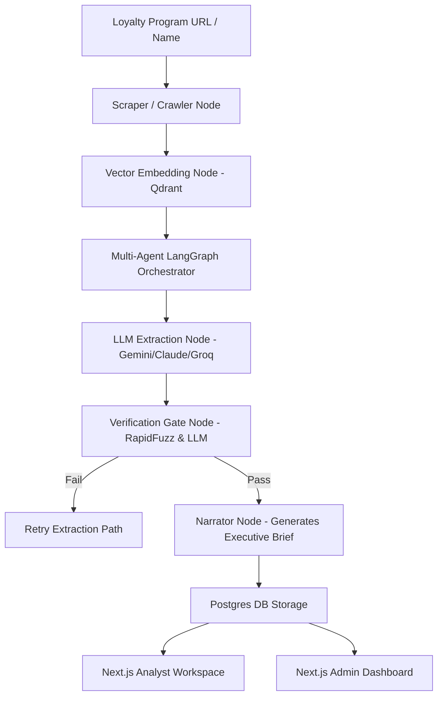

# InfoVac — Autonomous Competitive Intelligence Platform

InfoVac is a high-performance, consulting-grade multi-agentic platform built to autonomously scrape, extract, verify, analyze, and compare loyalty program structures. It combines a state-of-the-art **FastAPI + LangGraph** backend with a modern **Next.js 15 (React 19)** frontend designed around high-density, minimal-distraction enterprise user experience guidelines.

---

## 🏢 System Architecture



### 1. The Multi-Agent Pipeline (Backend)
- **Scraping & Ingestion**: Dynamically crawls faq, terms & conditions, benefits, and press releases using Firecrawl & Tavily.
- **Structured Extraction**: Extracts 43 specific loyalty fields (tiers, earn rates, burn rules, etc.) powered by Pydantic and Instructor using a resilient sequential pipeline structure to manage LLM rate limits.
- **Verification Gate**: Employs `rapidfuzz` partial-ratio matching and LLM corroboration to verify extracted claims against scraped sources. If fuzzy match score is `< 0.80`, fields are nullified or sent to retry paths to eliminate hallucinations.
- **RAG Q&A Engine**: A LangGraph agent integrated with a Qdrant vector database for answering contextual questions with precise web source citations.

### 2. High-Density UI Workspace (Frontend)
- **Analyst Workspace**:
  - Distraction-free, command-line style search bar.
  - Live Server-Sent Events (SSE) progress tracker showing scraping phases in real-time.
  - Academic-style `[N]` inline superscript citations.
  - Click-to-open **Evidence Drawer** highlighting the exact source sentence utilizing character start/end coordinates.
  - Clickable References section displaying the source URL, raw evidence snippet, and access date.
  - Draggable & resizable Quick-Chat widget with markdown rendering and prompt badges.
  - Clean client-side PDF export with active, clickable hyperlinks for all citations.
  - **LangSmith Tracing Button**: Integrates real-time agent tracing graphs. Shows a "View Trace" button next to "Re-analyse" to view the live execution steps on LangSmith.
- **Admin & Analytics Dashboard**:
  - Live system health monitoring (Postgres, backend connection).
  - Gate Verification Analytics (Pass/Fail ratios).
  - Confidence score breakdowns (Corroboration, Authority, Recency).
  - Category and Source distribution tracker showing volume ratios across categories.
  - Interactive multi-program **Strategic Comparator Picker** generating side-by-side matrices.

---

## 🚀 Quick Start

### Prerequisites
- **Python**: `3.10` or higher
- **Node.js**: `18.x` or higher
- **Docker**: For running Postgres

### 1. Environment Setup
Clone the repository and copy the example environment file:
```bash
cp .env.example .env
```
Fill in the required environment variables:
- `DATABASE_URL` / `SYNC_DATABASE_URL` (Defaults point to Docker Postgres)
- `GEMINI_API_KEY`, `ANTHROPIC_API_KEY`, or `CLAUDE_API_KEY` (Required for LLM extraction/chat)
- `TAVILY_API_KEY` and `FIRECRAWL_API_KEY` (Required for web crawling)

---

### 2. Installation (Automated Setup)

Run the automated onboarding setup script:
```bash
# Windows
.\setup.bat
```
*This script will dynamically:*
1. Copy `.env.example` to `.env` if missing.
2. Boot Postgres DB via Docker Compose.
3. Spin up Python virtual environment (`venv_infovac`) and install requirements.
4. Verify Node.js presence and install all frontend node packages inside `frontend/`.
5. Run schema migrations via Alembic.

*For manual setup:*
```bash
# Backend Setup
python -m venv .venv
source .venv/bin/activate  # Or .venv\Scripts\activate on Windows
pip install -r requirements.txt
alembic upgrade head

# Frontend Setup
cd frontend
npm install
```

---

### 3. Running the Platform (Single-Click)

To launch the full stack (FastAPI backend + Next.js dev server + Postgres DB):
```bash
# Windows
.\start.bat
```
*This launcher monitors the processes in the background. Pressing `Ctrl+C` inside `start.bat` triggers a recursive process tree shutdown (`taskkill /t`), stopping all child Python/Node servers and automatically closing their spawned console windows.*

*For manual startup:*
```bash
# 1. Start Postgres Database
docker-compose up -d

# 2. Run Backend Server (from root)
uvicorn backend.main:app --reload --port 8000

# 3. Run Frontend Server (from frontend directory)
cd frontend
npm run dev
```

The app will be accessible at:
- **Analyst Workspace**: `http://localhost:3000`
- **Admin Dashboard**: `http://localhost:3000/admin`
- **FastAPI API Docs**: `http://localhost:8000/docs`

---

## 🧪 Testing

To run the comprehensive system test (mock-based, runs in **9 seconds** without requiring database or live LLM tokens):
```bash
pytest tests/test_comprehensive_system.py -v -s
```

To run the full suite of end-to-end integration and unit tests:
```bash
# Activate your venv first
pytest tests/
```

To force-run sequential extraction for a specific loyalty program manually:
```bash
python scratch/force_extraction.py
```

---

## 🛠️ Technology Stack
- **Backend**: FastAPI, LangGraph, SQLAlchemy, Alembic, Qdrant, RapidFuzz, Instructor.
- **Frontend**: Next.js 15, Tailwind CSS, Lucide React, Radix UI, Sonner, @react-pdf/renderer.
- **Database**: PostgreSQL (Development & Vector Metadata), Qdrant (Vector Embedding Store).

---

## 🕸️ Codebase Knowledge Graph (Graphify)
This repository includes a pre-built **Graphify Codebase Knowledge Graph** in `graphify-out/` to allow developers and auditors to explore and query the architecture, node relations, and system flow directly from the command line.

To query the knowledge graph:
* **Ask questions about the architecture**:
  ```bash
  graphify query "How does the verification gate validate evidence quotes?"
  ```
* **Find shortest paths / relationships between files**:
  ```bash
  graphify path "backend/extractor.py" "orchestrator/nodes.py"
  ```
* **Explain a key architectural concept**:
  ```bash
  graphify explain "Verification Gate"
  ```


