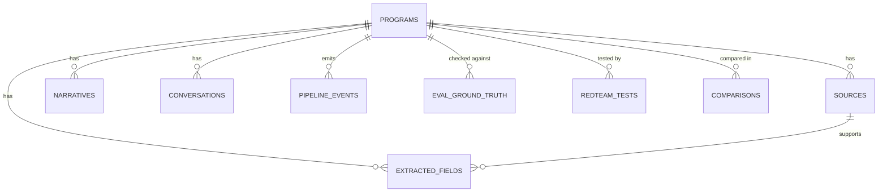

Let me re-ground in the actual problem statement first, since you're right to ask for this — a lot has been added since turn one and I want to verify nothing drifted from the original spec before finalizing.Confirmed — re-read line by line. Here's the compliance map before anything else, since this is the actual grading instrument:

## Compliance checklist

| Requirement (verbatim from spec) | Addressed by |
|---|---|
| Discover: not just homepage — FAQs, T&Cs, app reviews, press, news | Retriever: Tavily search across source-type queries + Firecrawl fetch |
| Extract: 35+ field structured schema | 43 fields, 8 categories (exceeds minimum) |
| Verify: cross-check, flag contradictions, every fact → verifiable URL | Citation-Verification Gate + Verifier contradiction logic |
| Narrate: 500-1000 word client-deck-ready brief | Narrator, word-count enforced programmatically |
| Compare: strategic advantages/gaps, not just side-by-side | Comparator, grounded in `extracted_fields` rows |
| Converse: follow-up Q&A, incl. "what changed in 6 months" | Chat endpoint, grounded-only; "what changed" is an honest-null case unless historical diff is built (flagged below) |
| 6 clearly separated components, not one prompt | Orchestrator/Retriever/Extractor/Verifier/Narrator/Comparator as distinct services |
| Avoid: "research [program]" as a single LLM call | Multi-stage pipeline, no single generative call does discovery+extraction+writing |
| Avoid: homepage-only scraping | Source-type diversity tracked and surfaced in UI |
| Avoid: hardcoding test programs | Cold-run testing discipline in task breakdown |
| Avoid: relying on LLM training data | Citation-verification gate rejects anything not textually present in fetched content |
| source_url + access_date non-negotiable | `SourcedValue` schema enforces both on every non-null field |
| Asymmetric scoring (+1/+0.5/0/−3) | Confidence-threshold null-handling, calibrated against this exact payoff structure |
| 4 proposal questions | Each gets a named section below |

**One gap I'm flagging honestly, not burying:** the example follow-up question *"What changed in the last 6 months?"* is explicitly given in the spec. Without historical tracking, the system can only answer this with an honest null. That's correct behavior, not a bug — but it's worth knowing going in rather than being surprised live. I've scoped a lightweight version into the 10-day plan below.

Now the full build.

---

# InfoVac — Final Build Spec (10-Day, 2-Engineer)

## 1. PRD

**Vision.** A structured, source-verified competitive intelligence agent for loyalty programs. Every non-null field traces to a `source_url` and `access_date`; every value passes a citation-verification gate before it's trusted; null is a correct answer when the data isn't verifiably there. The asymmetric scoring (+1 correct / +0.5 honest null / 0 miss / −3 hallucination) is treated as the literal spec, not a footnote — it drives the confidence threshold, not just the messaging.

**Competitive positioning (why this isn't redundant with existing tools).** Exchange Solutions already ships a loyalty-specific "Market Intelligence Agent." Klue, Crayon, and Kompyte already do citation-backed general competitive intelligence at $15K-$40K/year. None of them, as far as is publicly documented, programmatically verify that a cited source actually supports the claim attached to it before accepting it, or publish a deterministic confidence formula instead of a model's self-reported certainty. That's the differentiated claim — not "we found data," but "what we show you has already been checked, and we can prove it."

**The four things the proposal must answer, answered directly:**

1. **Grounding strategy — how do you ensure retrieval, not invention?**
   Structural role separation (fetched content is data, never instructions) + a citation-verification gate that fuzzy-matches every claimed value against the literal stored `raw_content` before acceptance. A field that can't be matched to real text on a real page is rejected to null, regardless of how plausible it sounds. This closes the gap RAG alone doesn't close — RAG biases the model toward grounded answers, it doesn't guarantee them; the gate is the actual guarantee.

2. **Multi-component interaction.**
   Orchestrator (LangGraph) sequences: Retriever → Content Sanitizer → Extractor → Citation-Verification Gate → Verifier → Narrator/Comparator. Each is a separately testable unit with its own input/output contract (see Architecture, below). The gate and Verifier are deliberately built as deterministic code, not LLM calls, specifically because they have to be trustworthy checks on stages that are non-deterministic.

3. **Adversarial case handling.**
   Low-web-presence programs: fill rate drops, but the gate still enforces zero fabrication — a thin profile with honest nulls, not a padded one. Recently-rebranded programs: contradiction detection surfaces conflicting old/new T&C language rather than silently picking one. Non-English markets: out of full scope for this build — explicitly stated, not silently ignored, with a named v2 direction (source-language detection + translation pass).

4. **Confidence scoring and null-handling.**
   Deterministic formula: `confidence = 0.5×corroboration + 0.3×authority + 0.2×recency`, computed only after the citation-verification gate passes. Null threshold calibrated against the rubric's own math: attempting a field only beats an honest null if calibrated correctness exceeds ~87.5% (derived from 4p − 3 = 0.5). Exact cutoff tuned against a hand-verified eval set built on Day 8, not picked analytically and left alone.

### Requirements

| ID | Requirement | Priority |
|---|---|---|
| R1 | Research any loyalty program from live web, including programs never tested by the team | P0 |
| R2 | 43-field schema, 8 categories, exceeds the 35+ minimum | P0 |
| R3 | Every non-null field has `source_url` + `access_date` | P0 |
| R4 | Citation-verification gate — claimed value must match real source text | P0 |
| R5 | Deterministic confidence score, calibrated against the eval set | P0 |
| R6 | Honest null on unverifiable/unfound fields | P0 |
| R7 | 500-1000 word narrative, word count enforced in code | P0 |
| R8 | Two-program comparison — strategic advantages/gaps, source-backed | P1 |
| R9 | Grounded 3+ turn follow-up Q&A, no outside knowledge | P1 |
| R10 | Contradiction detection across disagreeing sources | P1 |
| R11 | Structural defense against indirect prompt injection from scraped content | P0 |
| R12 | Source-type diversity (not homepage-only) visible in output | P1 |

### Anti-requirements (explicit, stated up front so they're a decision, not an oversight)

Multi-user auth, full non-English support, continuous monitoring/scheduling, PDF/PPT export, byte-level output determinism (researched, not pursued — see prior discussion).

---

## 2. MVP Scope

| Feature | Rubric line it serves | In scope (10 days) |
|---|---|---|
| Source-attributed extraction, 43 fields | Factual Accuracy (35) + Source Attribution (15) | ✅ Core build |
| Citation-verification gate | Factual Accuracy (35), System Robustness (10) | ✅ Core build |
| Deterministic confidence formula | Factual Accuracy, addresses proposal Q4 | ✅ Core build |
| Hand-verified eval harness (8-10 programs) | Pre-empts the judges' own spot-check | ✅ Day 8 |
| Red-team / injection test suite | System Robustness (10), addresses proposal Q1 | ✅ Day 9 |
| Source-verification deep-link UI (Text Fragment) | Source Attribution (15), demo quality | ✅ Day 6 |
| 500-1000 word narrative | Narrative Quality (10) | ✅ Core build |
| Two-program comparison | Comparison Quality (10) | ✅ Core build |
| Grounded chat (3+ turns) | Robustness, "Converse" requirement | ✅ Core build |
| Self-consistency voting (N=2-3) on highest-ambiguity categories | Factual Accuracy | ✅ Stretch, Day 8 if time permits |
| Historical diff (Wayback Machine) for "what changed" | Direct answer to spec's own example question | 🟡 Stretch, Day 9-10, fallback to honest null if archive coverage is poor |
| Multi-tenancy, observability, CI | Production-integration credibility (Kobie conversation) | ❌ Named as roadmap, not built — stated explicitly in the proposal |
| Non-English support | Adversarial case (proposal Q3) | ❌ Tested for graceful degradation only, not solved |

---

## 3. Tech Stack — final

| Layer | Choice | Why (post-research) |
|---|---|---|
| LLM | Claude (default), quick A/B vs Gemini on Day 1 | Claude's error profile under-extracts rather than fabricates, which matches the rubric's +0.5/−3 asymmetry better than Gemini's raw-accuracy edge. Verify on your own eval set before locking it in — don't take either claim on faith. |
| Orchestration | LangGraph | Confirmed leading 2026 framework; explicit graph/retry/branch semantics map onto the 6-component spec directly, useful for both execution and the architecture diagram you show judges. |
| Structured extraction | Instructor (wraps Claude) | Pydantic-validated, automatic retry on schema failure — replaces hand-rolled validation for near-zero cost. |
| Source discovery | Tavily | Search-purpose-built, returns ranked LLM-ready snippets. |
| Page fetch | Firecrawl | Handles JS-rendered pages (BS4 can't) and PDF extraction (T&Cs are sometimes PDFs) — closes a real gap in the original design. |
| Backend | FastAPI | Still the 2026 default for async LLM/agent backends; your actual bottleneck is external API latency, not request-serialization speed, so framework throughput races (Litestar) don't matter here. |
| Validation | Pydantic v2 | Native to Instructor and FastAPI. |
| Database | PostgreSQL 15 (JSONB where needed) | Relational core + flexible fields fits the schema exactly; no reason to consider a document store. |
| Job state / SSE pub-sub | **Postgres LISTEN/NOTIFY + SKIP LOCKED — no Redis** | Redis's throughput advantage only matters past ~100K jobs/hour; your bottleneck is the Tavily/Firecrawl/Claude calls, not the queue. Removing Redis removes a whole service from docker-compose and a vendor to explain in the Kobie conversation. |
| Frontend | Next.js 14 + shadcn/ui + Tailwind | Fastest path to a professional-looking UI in days, not weeks; native SSE consumption via App Router. |
| State | Zustand | Low-stakes; app has ~4-5 pieces of cross-component state. |
| Charts | Recharts | Sufficient for confidence/comparison visualizations. |
| Container | Docker Compose | One service lighter than the original plan (no Redis container). |
| Hosting | Railway | Fastest code-to-URL path for a 10-day build; revisit if this becomes a real product. |

---

## 4. Architecture Diagram

```
Frontend (Next.js, SSE via Postgres LISTEN/NOTIFY)
        │
        ▼
API Gateway (FastAPI)
        │
        ▼
Orchestrator (LangGraph — retries, branching, audit trail)
        │
        ▼
Retriever
  ├─ Tavily (discovery: FAQ / T&C / app review / press / forum queries)
  └─ Firecrawl (fetch: static HTML or JS-rendered, + PDF extraction)
        │
        ▼
Content Sanitizer
  (fetched content → tool-result data block, never instruction-role;
   structural defense against indirect prompt injection)
        │
        ▼
Extractor (Claude via Instructor — Pydantic-validated, auto-retry;
           self-consistency N=2-3 on highest-ambiguity categories)
        │
        ▼
Citation-Verification Gate  ◄── deterministic, not an LLM call
  (claimed snippet must fuzzy-match stored raw_content,
   or field is rejected → null)
        │
        ▼
Verifier  ◄── deterministic, not an LLM call
  (cross-source contradiction check;
   confidence = 0.5·corroboration + 0.3·authority + 0.2·recency;
   null below calibrated threshold)
        │
   ┌────┴────┐
   ▼         ▼
Narrator   Comparator
(500-1000w  (two-program strategic
 brief)      diff, source-backed)
        │
        ▼
extracted_fields / narratives / comparisons (Postgres)
        │
        ▼
Chat (grounded-only re-query of this program's verified fields,
      no outside knowledge, full context re-injected every turn)
```

**Two structural decisions worth defending explicitly if asked:** the gate and the formula are the only two components in this entire pipeline guaranteed not to vary between runs — that's deliberate. Every LLM-touching stage upstream of them is non-deterministic by nature; these two exist specifically to provide a stable check against that variability, not to add features.

---

Continue with Database Schema, API Design, Wireframes, and the 10-day Task Breakdown next?

## 5. Database Schema

Three deliberate additions beyond the original design: a `pipeline_events` table that implements the Postgres-only SSE decision concretely (replacing Redis pub/sub with a trigger + `LISTEN/NOTIFY`), and `eval_ground_truth` + `redteam_tests` tables that turn the Day 8-9 evidence-gathering work into queryable data instead of a spreadsheet someone forgets to bring to the demo.

```sql
CREATE EXTENSION IF NOT EXISTS pgcrypto;

CREATE TABLE programs (
    id              UUID PRIMARY KEY DEFAULT gen_random_uuid(),
    name            VARCHAR(255) NOT NULL,
    status          VARCHAR(50)  NOT NULL DEFAULT 'pending',
    llm_used        VARCHAR(50)  NOT NULL DEFAULT 'claude',  -- claude|gemini, set by Day-1 A/B result
    schema_version  VARCHAR(10)  NOT NULL DEFAULT 'v1',
    created_at      TIMESTAMPTZ  NOT NULL DEFAULT now(),
    completed_at    TIMESTAMPTZ,
    error_message   TEXT
);

CREATE TABLE sources (
    id              UUID PRIMARY KEY DEFAULT gen_random_uuid(),
    program_id      UUID NOT NULL REFERENCES programs(id) ON DELETE CASCADE,
    url             TEXT NOT NULL,
    source_type     VARCHAR(50) NOT NULL, -- homepage|faq|tnc|app_review|press|news|forum
    title           TEXT,
    raw_content     TEXT,                  -- verbatim — this is what the gate checks against
    content_hash    VARCHAR(64),
    fetch_method    VARCHAR(20) NOT NULL DEFAULT 'firecrawl', -- firecrawl|tavily_snippet
    fetched_at      TIMESTAMPTZ NOT NULL DEFAULT now(),
    fetch_status    VARCHAR(20) NOT NULL DEFAULT 'success',
    UNIQUE(program_id, url)
);

CREATE TABLE extracted_fields (
    id                          UUID PRIMARY KEY DEFAULT gen_random_uuid(),
    program_id                  UUID NOT NULL REFERENCES programs(id) ON DELETE CASCADE,
    category                    VARCHAR(50) NOT NULL,
    field_name                  VARCHAR(100) NOT NULL,
    field_value                 JSONB,
    is_null                     BOOLEAN NOT NULL DEFAULT FALSE,

    -- citation-verification gate
    claimed_snippet             TEXT,
    gate_passed                 BOOLEAN,
    match_score                 NUMERIC(4,3),

    -- confidence formula — sub-scores stored individually, not just the final number,
    -- so the calibration step on Day 8 can be debugged and retuned against real data
    corroboration_score         NUMERIC(3,2),
    authority_score              NUMERIC(3,2),
    recency_score                NUMERIC(3,2),
    confidence                  NUMERIC(3,2),

    source_id                   UUID REFERENCES sources(id),
    access_date                 TIMESTAMPTZ,
    contradiction_flag          BOOLEAN NOT NULL DEFAULT FALSE,
    contradiction_note          TEXT,

    self_consistency_runs       JSONB,   -- [{value, source_id}, ...] when N>1 sampling used
    self_consistency_agreement  NUMERIC(3,2),

    created_at                  TIMESTAMPTZ NOT NULL DEFAULT now(),
    UNIQUE(program_id, field_name)
);

CREATE TABLE narratives (
    id              UUID PRIMARY KEY DEFAULT gen_random_uuid(),
    program_id      UUID NOT NULL REFERENCES programs(id) ON DELETE CASCADE,
    narrative_text  TEXT NOT NULL,
    word_count      INT NOT NULL,
    created_at      TIMESTAMPTZ NOT NULL DEFAULT now()
);

CREATE TABLE comparisons (
    id              UUID PRIMARY KEY DEFAULT gen_random_uuid(),
    program_a_id    UUID NOT NULL REFERENCES programs(id),
    program_b_id    UUID NOT NULL REFERENCES programs(id),
    analysis_json   JSONB NOT NULL,
    created_at      TIMESTAMPTZ NOT NULL DEFAULT now()
);

CREATE TABLE conversations (
    id                  UUID PRIMARY KEY DEFAULT gen_random_uuid(),
    program_id          UUID NOT NULL REFERENCES programs(id) ON DELETE CASCADE,
    role                VARCHAR(20) NOT NULL,
    message             TEXT NOT NULL,
    grounded_field_ids  UUID[],
    created_at          TIMESTAMPTZ NOT NULL DEFAULT now()
);

-- Replaces Redis pub/sub entirely. A trigger fires pg_notify on every event row;
-- FastAPI's SSE endpoint runs `LISTEN pipeline_events_{program_id}` via asyncpg
-- and streams payloads straight through. One fewer service to run or explain.
CREATE TABLE pipeline_events (
    id          BIGSERIAL PRIMARY KEY,
    program_id  UUID NOT NULL REFERENCES programs(id) ON DELETE CASCADE,
    stage       VARCHAR(50) NOT NULL,
    progress    NUMERIC(3,2),
    detail      TEXT,
    created_at  TIMESTAMPTZ NOT NULL DEFAULT now()
);

CREATE OR REPLACE FUNCTION notify_pipeline_event() RETURNS trigger AS $$
BEGIN
    PERFORM pg_notify('pipeline_events_' || NEW.program_id::text, row_to_json(NEW)::text);
    RETURN NEW;
END;
$$ LANGUAGE plpgsql;

CREATE TRIGGER trg_pipeline_event
AFTER INSERT ON pipeline_events
FOR EACH ROW EXECUTE FUNCTION notify_pipeline_event();

-- Day 8: hand-verified ground truth. This table is what makes "verified field rate"
-- a real, queryable number instead of a claim in a slide.
CREATE TABLE eval_ground_truth (
    id              UUID PRIMARY KEY DEFAULT gen_random_uuid(),
    program_id      UUID NOT NULL REFERENCES programs(id) ON DELETE CASCADE,
    field_name      VARCHAR(100) NOT NULL,
    expected_value  JSONB,                  -- null = team manually confirmed this is genuinely unknown
    verified_by     VARCHAR(100) NOT NULL,
    verified_at     TIMESTAMPTZ NOT NULL DEFAULT now(),
    UNIQUE(program_id, field_name)
);

-- Day 9: red-team log — also doubles as live evidence in the demo/review
CREATE TABLE redteam_tests (
    id              UUID PRIMARY KEY DEFAULT gen_random_uuid(),
    test_name       VARCHAR(100) NOT NULL,  -- injection_forum_post | low_web_presence | recently_rebranded
    program_id      UUID REFERENCES programs(id),
    payload         TEXT,
    expected_result VARCHAR(50) NOT NULL,   -- gate_rejects | graceful_null
    actual_result   VARCHAR(50),
    passed          BOOLEAN,
    run_at          TIMESTAMPTZ NOT NULL DEFAULT now()
);

CREATE INDEX idx_fields_program       ON extracted_fields(program_id);
CREATE INDEX idx_sources_program      ON sources(program_id);
CREATE INDEX idx_fields_contradiction ON extracted_fields(contradiction_flag) WHERE contradiction_flag = TRUE;
CREATE INDEX idx_fields_gate_failed   ON extracted_fields(gate_passed) WHERE gate_passed = FALSE;
CREATE INDEX idx_events_program       ON pipeline_events(program_id, created_at);
```



---

## 6. API Design

### `SourcedValue` — updated with the gate and the deep-link

```json
{
  "value": "5% cashback on dining",
  "is_null": false,
  "confidence": 0.91,
  "confidence_breakdown": { "corroboration": 0.8, "authority": 1.0, "recency": 1.0 },
  "gate_passed": true,
  "source_url": "https://example.com/rewards/faq",
  "source_url_highlighted": "https://example.com/rewards/faq#:~:text=5%25%20cashback%20on%20dining",
  "access_date": "2026-06-19T10:32:00Z",
  "contradiction_flag": false,
  "contradiction_note": null
}
```

`source_url_highlighted` is generated server-side by URL-encoding the matched snippet into a [Text Fragment](https://example.com#:~:text=) — this is the deep-link UI decided earlier, and it costs nothing beyond string formatting since the matched snippet is already stored from the gate check.

### Endpoints

| Method | Endpoint | Purpose |
|---|---|---|
| `POST` | `/api/programs` | Start a research job |
| `GET` | `/api/programs/{id}` | Full program object once complete |
| `GET` | `/api/programs/{id}/stream` | SSE, backed by `LISTEN pipeline_events_{id}` |
| `GET` | `/api/programs/{id}/narrative` | 500-1000 word brief |
| `GET` | `/api/programs/{id}/sources` | All sources, with type + fetch status |
| `POST` | `/api/compare` | Two-program strategic comparison |
| `GET` | `/api/compare/{id}` | Comparison result |
| `POST` | `/api/programs/{id}/chat` | Grounded follow-up Q&A |
| `GET` | `/api/programs/{id}/chat` | Conversation history |
| `GET` | **`/api/eval/summary`** | Verified field rate, hallucination rate, fill rate — computed live from `eval_ground_truth` vs `extracted_fields` |
| `GET` | **`/api/redteam/results`** | Red-team test outcomes — pass/fail per test, with payload and actual result |

The last two are new and worth calling out: they're not internal dev tooling, they're the evidence layer. Pointing a judge or a Kobie reviewer at `/api/eval/summary` mid-conversation and having it return real, queryable numbers is a categorically different move than describing your accuracy in a slide.

### SSE stream (unchanged wire format, different backend)

```
event: stage_update
data: {"stage": "retrieving", "progress": 0.20, "detail": "Found 16 candidate sources"}

event: stage_update
data: {"stage": "extracting", "progress": 0.45, "detail": "31/43 fields, gate rejected 2"}

event: stage_update
data: {"stage": "verifying", "progress": 0.70, "detail": "1 contradiction flagged"}

event: complete
data: {"program_id": "uuid", "verified_field_rate": 0.93, "contradiction_count": 1}
```

---

## 7. Wireframes (text format)

Screens 1, 2, 4, 5 (input, progress, comparison, chat) are unchanged from the earlier version. Two updates:

**Screen 3 — Results, with the gate and deep-link visible**
```
┌──────────────────────────────────────────────────────┐
│  Starbucks Rewards          43 fields · 6 null · 1 ⚠  │
├───────────────────┬────────────────────────────────────┤
│ Categories         │ Earn mechanics                     │
│ ▸ Program basics    │                                    │
│ ▸ Partnerships      │ Base earn rate                     │
│ ● Earn mechanics    │ 2 stars per $1            ●0.91    │
│ ▸ Digital experience│ gate: passed ✓                     │
│ ▸ Burn mechanics    │ → [view exact source text ↗]       │
│ ▸ Sentiment         │   (opens page, snippet highlighted)│
│ ▸ Tiers             │ corroboration 0.8 · authority 1.0   │
│ ▸ Competitive pos.  │ · recency 1.0                      │
└───────────────────┴────────────────────────────────────┘
```
*The "[view exact source text ↗]" link is the Text Fragment deep-link — clicking it opens the actual live page with the claimed phrase highlighted by the browser natively. This single UI element is the strongest "don't trust us, check it yourself" move available.*

**Screen 6 — NEW: Evidence dashboard**
```
┌──────────────────────────────────────────────────────┐
│  System Evidence                                       │
├──────────────────────────────────────────────────────┤
│  Eval set: 10 programs, hand-verified                  │
│  Verified field rate:     93%                          │
│  Hallucination rate:      0%                            │
│  Fill rate:                89%                           │
├──────────────────────────────────────────────────────┤
│  Red-team results                                       │
│  ✓ Injection payload (forum post)     → gate rejected   │
│  ✓ Low-web-presence program           → graceful null   │
│  ✓ Recently rebranded program         → contradiction    │
│                                          flagged, not     │
│                                          silently picked  │
└──────────────────────────────────────────────────────┘
```
*This screen is new specifically because it's the highest-leverage thing identified across this whole conversation — preempting the judges' or Kobie's own audit by showing them the numbers before they ask.*

---

## 8. Task Breakdown — 10 days, 2 engineers

| Day | Engineer A (pipeline/backend) | Engineer B (frontend/reasoning) |
|---|---|---|
| 1 | Docker (Postgres only), Pydantic schema + Instructor wiring, API contract freeze | Next.js + shadcn scaffold, static wireframe components; run the quick Claude-vs-Gemini Extractor A/B on 3 programs once setup allows |
| 2 | Retriever: Tavily (discovery) + Firecrawl (fetch), source-type classification | Orchestrator skeleton (LangGraph) + Postgres `LISTEN/NOTIFY` SSE plumbing (trigger + listener) |
| 3 | Extractor: Instructor-wrapped Claude calls, Content Sanitizer (role separation) | Citation-Verification Gate: fuzzy-match logic + unit tests against known good/bad snippets |
| 4 | Verifier: confidence formula, contradiction detection | Wire Extractor → Gate → Verifier, test end-to-end on 1 program |
| 5 | Full pipeline into Orchestrator (retries, error handling) | Narrator (word-count enforced) + Comparator skeleton |
| 6 | Run pipeline on 4 more programs across industries, fix extraction edge cases | Frontend wired to real API + SSE: progress screen, schema view, Text Fragment deep-links |
| 7 | Chat endpoint (grounded, full-context re-injection per turn) | Chat UI + Comparator UI |
| 8 | **Build + hand-verify eval set (10 programs, split labor) → `eval_ground_truth`; retune null threshold against real data** | Same — this is a two-person job. Stretch if ahead: self-consistency N=2-3 on sentiment + competitive-position fields |
| 9 | **Red-team suite: injection test page, low-presence + rebranded test cases → `redteam_tests`; fix gaps found** | Evidence dashboard UI (Screen 6), wire to `/api/eval/summary` + `/api/redteam/results` |
| 10 | Final full eval re-run, README + architecture doc, demo rehearsal | Prep technical Q&A backup material: competitive positioning, cited papers, security writeup; stretch — Wayback Machine diff for "what changed," else document as honest roadmap item |

**The one sequencing risk worth naming:** Days 8-9 are non-negotiable, not optional polish — they're where the eval numbers and red-team evidence actually get produced. If Days 1-7 run long, protect 8-9 by cutting Comparator UI polish or chat multi-turn depth before cutting the evidence work. A system with no shown evidence and a perfect demo loses to a system with visible evidence and a rougher demo, given how this rubric is built.