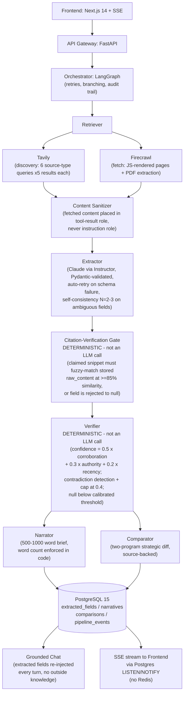
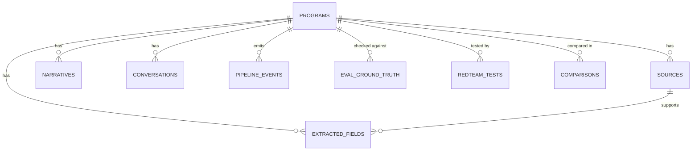

# InfoVac: Solution Document

## Problem Statement

Build a structured competitive intelligence agent for loyalty programs that:

- Discovers information from multiple source types (FAQs, T&Cs, app reviews, press, news, forums) rather than just the homepage
- Extracts data into a schema of 35+ fields across 8 categories
- Verifies every extracted fact against a source URL with an access date
- Flags contradictions across sources
- Generates a 500-1000 word client-ready narrative
- Compares two programs strategically (advantages and gaps, not just side-by-side)
- Supports 3+ turn follow-up Q&A grounded only in verified data

The system must be structured as 6 clearly separated components. A single LLM call that does discovery, extraction, and writing in one step is an explicit disqualifier.

The scoring rubric is asymmetric: +1 correct / +0.5 honest null / 0 miss / -3 hallucination. This drives all null-handling decisions in the design.

---

## Requirements

| ID  | Requirement                                                        | Priority |
|-----|--------------------------------------------------------------------|----------|
| R1  | Research any loyalty program from live web (no hardcoded programs) | P0       |
| R2  | 43-field schema, 8 categories                                      | P0       |
| R3  | Every non-null field has `source_url` + `access_date`              | P0       |
| R4  | Citation-verification gate: claimed value must match real source text | P0    |
| R5  | Deterministic confidence score calibrated against the eval set     | P0       |
| R6  | Honest null on unverifiable or unfound fields                      | P0       |
| R7  | 500-1000 word narrative, word count enforced in code               | P0       |
| R8  | Two-program comparison with strategic advantages/gaps              | P1       |
| R9  | Grounded 3+ turn follow-up Q&A, no outside knowledge              | P1       |
| R10 | Contradiction detection across disagreeing sources                 | P1       |
| R11 | Structural defense against indirect prompt injection               | P0       |
| R12 | Source-type diversity visible in output                            | P1       |

**Out of scope (explicit non-requirements):** multi-user auth, full non-English support, continuous monitoring, PDF/PPT export.

---

## Solution Approach

The core insight: RAG alone biases the model toward grounded answers but does not guarantee them. The Citation-Verification Gate is the actual guarantee. It is a deterministic code check (not an LLM call) that fuzzy-matches every claimed value against literal stored raw content. A field that cannot be matched to real text on a real page is rejected to null.

The pipeline separates concerns across 6 components. Fetched content is always treated as data, never as an instruction that the LLM processes as if it were a prompt (structural prompt-injection defense).

---

## MVP Architecture



Two components are deliberately deterministic: the Citation-Verification Gate and the Verifier. Every other component that touches an LLM is non-deterministic. These two exist as stable checkpoints against that variability.

---

## Tech Stack

| Layer | Choice | Reason |
|---|---|---|
| LLM | Claude (A/B vs Gemini on Day 1) | Claude under-extracts rather than fabricates, matching the -3 hallucination penalty better |
| Orchestration | LangGraph | Explicit graph, retry, and branch semantics map directly onto the 6-component pipeline |
| Structured extraction | Instructor (wraps Claude) | Pydantic-validated output, automatic retry on schema failure |
| Source discovery | Tavily | Search-purpose-built, returns ranked LLM-ready snippets |
| Page fetch | Firecrawl | Handles JS-rendered pages and PDF extraction; BeautifulSoup4 cannot |
| Backend | FastAPI | Async-native, standard LLM/agent backend |
| Validation | Pydantic v2 | Native to Instructor and FastAPI |
| Database | PostgreSQL 15 (JSONB) | Relational core with flexible field storage; no document store needed |
| Job state / pub-sub | Postgres LISTEN/NOTIFY | Replaces Redis entirely; removes one service from docker-compose |
| Frontend | Next.js 14 + shadcn/ui + Tailwind | Native SSE via App Router; production-quality UI in days |
| State | Zustand | 4-5 pieces of cross-component state |
| Charts | Recharts | Confidence and comparison visualizations |
| Container | Docker Compose | Postgres only (no Redis) |
| Hosting | Railway | Fastest code-to-URL path for a 10-day build |

---

## Database Schema

Nine tables total. Three deliberate additions beyond the minimum: `pipeline_events` implements Postgres-only SSE (replacing Redis pub/sub via trigger + LISTEN/NOTIFY); `eval_ground_truth` and `redteam_tests` make the Day 8-9 evidence queryable instead of spreadsheet-based.

```sql
CREATE TABLE programs (
    id              UUID PRIMARY KEY DEFAULT gen_random_uuid(),
    name            VARCHAR(255) NOT NULL,
    status          VARCHAR(50)  NOT NULL DEFAULT 'pending',
    llm_used        VARCHAR(50)  NOT NULL DEFAULT 'claude',
    schema_version  VARCHAR(10)  NOT NULL DEFAULT 'v1',
    created_at      TIMESTAMPTZ  NOT NULL DEFAULT now(),
    completed_at    TIMESTAMPTZ,
    error_message   TEXT
);

CREATE TABLE sources (
    id              UUID PRIMARY KEY DEFAULT gen_random_uuid(),
    program_id      UUID NOT NULL REFERENCES programs(id) ON DELETE CASCADE,
    url             TEXT NOT NULL,
    source_type     VARCHAR(50) NOT NULL, -- homepage|faq|tnc|app_review|press|news|forum
    raw_content     TEXT,                  -- verbatim text the gate checks against
    fetch_method    VARCHAR(20) NOT NULL DEFAULT 'firecrawl',
    fetched_at      TIMESTAMPTZ NOT NULL DEFAULT now(),
    fetch_status    VARCHAR(20) NOT NULL DEFAULT 'success', -- success|robots_blocked|robots_unverified
    UNIQUE(program_id, url)
);

CREATE TABLE extracted_fields (
    id                          UUID PRIMARY KEY DEFAULT gen_random_uuid(),
    program_id                  UUID NOT NULL REFERENCES programs(id) ON DELETE CASCADE,
    category                    VARCHAR(50) NOT NULL,
    field_name                  VARCHAR(100) NOT NULL,
    field_value                 JSONB,
    is_null                     BOOLEAN NOT NULL DEFAULT FALSE,

    -- citation-verification gate columns
    claimed_snippet             TEXT,
    gate_passed                 BOOLEAN,
    match_score                 NUMERIC(4,3),

    -- confidence sub-scores stored individually for Day 8 calibration/debugging
    corroboration_score         NUMERIC(3,2),
    authority_score             NUMERIC(3,2),
    recency_score               NUMERIC(3,2),
    confidence                  NUMERIC(3,2),  -- ONLY written by verifier.py

    source_id                   UUID REFERENCES sources(id),
    access_date                 TIMESTAMPTZ,
    contradiction_flag          BOOLEAN NOT NULL DEFAULT FALSE,
    contradiction_note          TEXT,
    self_consistency_runs       JSONB,          -- [{value, source_id}, ...] when N>1 sampling used
    self_consistency_agreement  NUMERIC(3,2),
    UNIQUE(program_id, field_name)
);
```



Key design rule: `model_certainty_hint` is the LLM self-assessment stored on the extracted record as a hint only. It is never written to `extracted_fields.confidence`. The `confidence` column is exclusively written by `verifier.py` after the gate passes.

---

## Confidence Formula

```
confidence = 0.5 x corroboration_score
           + 0.3 x authority_score
           + 0.2 x recency_score
```

**Authority weights by source type:**
| Source Type | Weight |
|---|---|
| T&C / legal page | 1.0 |
| Press release | 0.9 |
| FAQ | 0.8 |
| News | 0.7 |
| App review | 0.6 |
| Forum | 0.5 |

**Recency decay:** Linear from 1.0 (30 days old or less) to 0.3 (365 days or more). Floor is 0.3.

**Null threshold:** A field is left null if calibrated confidence is below approximately 0.875. This threshold is derived from the rubric's own math: attempting a fill only beats an honest null if the expected score from filling (p x 1 + (1-p) x -3) exceeds 0.5. Solving: p > 0.875. This number is a placeholder; it must be tuned against the real eval set on Day 8.

**Contradiction handling:** If two sources disagree on a field, both are flagged and the confidence is capped at 0.4 regardless of other scores.

---

## API Design

### SourcedValue Schema

Every non-null field in the API response carries this structure:

```json
{
  "value": "5% cashback on dining",
  "is_null": false,
  "confidence": 0.91,
  "confidence_breakdown": { "corroboration": 0.8, "authority": 1.0, "recency": 1.0 },
  "gate_passed": true,
  "source_url": "https://example.com/rewards/faq",
  "source_url_highlighted": "https://example.com/rewards/faq#:~:text=5%25%20cashback%20on%20dining",
  "access_date": "2026-06-19T10:32:00Z",
  "contradiction_flag": false,
  "contradiction_note": null
}
```

`source_url_highlighted` is a Text Fragment deep-link generated server-side. Clicking it opens the live source page with the exact matched snippet highlighted by the browser. This is the primary "verify it yourself" mechanism.

### Endpoints

| Method | Endpoint | Purpose |
|---|---|---|
| POST | `/api/programs` | Start a research job |
| GET | `/api/programs/{id}` | Full program object once complete |
| GET | `/api/programs/{id}/stream` | SSE stream backed by `LISTEN pipeline_events_{id}` |
| GET | `/api/programs/{id}/narrative` | 500-1000 word brief |
| GET | `/api/programs/{id}/sources` | All sources with type and fetch status |
| POST | `/api/compare` | Two-program strategic comparison |
| GET | `/api/compare/{id}` | Comparison result |
| POST | `/api/programs/{id}/chat` | Grounded follow-up Q&A |
| GET | `/api/programs/{id}/chat` | Conversation history |
| GET | `/api/eval/summary` | Verified field rate, hallucination rate, fill rate from eval set |
| GET | `/api/redteam/results` | Red-team test outcomes per test case |

### SSE Stream Format

```
event: stage_update
data: {"stage": "retrieving",  "progress": 0.20, "detail": "Found 16 candidate sources"}

event: stage_update
data: {"stage": "extracting",  "progress": 0.45, "detail": "31/43 fields, gate rejected 2"}

event: stage_update
data: {"stage": "verifying",   "progress": 0.70, "detail": "1 contradiction flagged"}

event: complete
data: {"program_id": "uuid", "verified_field_rate": 0.93, "contradiction_count": 1}
```

---

## MVP Scope

| Feature | Rubric line | Status |
|---|---|---|
| Source-attributed extraction, 43 fields | Factual Accuracy + Source Attribution | Core build |
| Citation-verification gate | Factual Accuracy, System Robustness | Core build |
| Deterministic confidence formula | Factual Accuracy | Core build |
| 500-1000 word narrative | Narrative Quality | Core build |
| Two-program comparison | Comparison Quality | Core build |
| Grounded chat (3+ turns) | Robustness, Converse requirement | Core build |
| Source-verification deep-link UI (Text Fragment) | Source Attribution, demo quality | Day 6 |
| Hand-verified eval harness (10 programs) | Pre-empts judges' spot-check | Day 8 |
| Red-team / injection test suite | System Robustness | Day 9 |
| Self-consistency voting (N=2-3) on ambiguous categories | Factual Accuracy | Stretch, Day 8 |
| Historical diff via Wayback Machine for "what changed" | Direct answer to spec example question | Stretch, Day 9-10 |
| Multi-tenancy, observability, CI | Production credibility | Roadmap only |
| Non-English support | Adversarial case | Graceful degradation only |

---

## 10-Day Task Breakdown

| Day | Engineer A (pipeline/backend) | Engineer B (frontend/reasoning) |
|---|---|---|
| 1 | Docker (Postgres only), Pydantic schema + Instructor wiring, API contract freeze | Next.js + shadcn scaffold, static wireframe components; Claude vs Gemini A/B on 3 programs |
| 2 | Retriever: Tavily (discovery) + Firecrawl (fetch), source-type classification | Orchestrator skeleton (LangGraph) + Postgres LISTEN/NOTIFY SSE plumbing |
| 3 | Extractor: Instructor-wrapped LLM calls, Content Sanitizer (role separation) | Citation-Verification Gate: fuzzy-match logic + unit tests |
| 4 | Verifier: confidence formula, contradiction detection | Wire Extractor -> Gate -> Verifier, test end-to-end on 1 program |
| 5 | Full pipeline into Orchestrator (retries, error handling) | Narrator (word-count enforced) + Comparator skeleton |
| 6 | Run pipeline on 4 more programs, fix extraction edge cases | Frontend wired to real API + SSE: progress screen, schema view, Text Fragment deep-links |
| 7 | Chat endpoint (grounded, full-context re-injection per turn) | Chat UI + Comparator UI |
| 8 | Hand-verify eval set (10 programs) -> eval_ground_truth; retune null threshold | Same (split labor). Stretch: self-consistency N=2-3 on sentiment + competitive-position fields |
| 9 | Red-team suite: injection test, low-presence, rebranded programs -> redteam_tests | Evidence dashboard UI, wire to `/api/eval/summary` + `/api/redteam/results` |
| 10 | Final full eval re-run, README + architecture doc, demo rehearsal | Technical Q&A prep; stretch: Wayback Machine diff |

Days 8-9 are non-negotiable. If Days 1-7 run long, cut Comparator UI polish or chat multi-turn depth before cutting the evidence work. A system with visible, queryable evidence loses to nothing.

---

## Adversarial Case Handling

| Case | System Behavior |
|---|---|
| Low web-presence program | Fill rate drops; gate still enforces zero fabrication; honest nulls returned, no padding |
| Recently rebranded program | Contradiction detection surfaces conflicting old/new T&C language; both versions flagged, neither silently selected |
| Indirect prompt injection via scraped content | Content Sanitizer places fetched text in tool-result data role, not instruction role; cannot affect LLM behavior |
| Non-English sources | Out of scope for MVP; graceful degradation with documented v2 path (source-language detection + translation pass) |

---

## Unresolved Items Before Building

The following numbers are placeholders that must be validated against real data:

| Item | Current value | Action required |
|---|---|---|
| Confidence formula weights | 0.5 / 0.3 / 0.2 | Retune on Day 8 eval set |
| Null threshold | 0.875 | Retune on Day 8 eval set |
| Fuzzy-match similarity threshold (gate) | ~0.85 | Needs explicit value and tuning |
| Self-consistency N | 2-3 | Pick one number before Day 8 |
| Eval set size and specific program names | 10 programs | Name the programs before Day 8 |
| Which fields get self-consistency | Sentiment + competitive position | Validate against field-level ambiguity data |

---

## Question for Kobie Mentor

The current system uses a PostgreSQL-backed deterministic verification approach: all extracted data is stored in structured tables, and the Citation-Verification Gate performs fuzzy-match checks against raw content at query time.

An alternative is to use a standard RAG (Retrieval-Augmented Generation) approach, where source documents are chunked, embedded into a vector store, and retrieved at query time using semantic similarity search.

**Question:** For the document generation and Q&A components specifically, should we use a standard RAG pipeline over a vector store, or continue with the PostgreSQL-backed structured extraction approach where all fields are pre-extracted and stored relationally before any narrative or comparison is generated?

The RAG approach would allow more flexible querying of source documents but introduces semantic retrieval as a non-deterministic step. The PostgreSQL approach keeps all retrieval deterministic but requires the full extraction pipeline to run before any output is produced.
