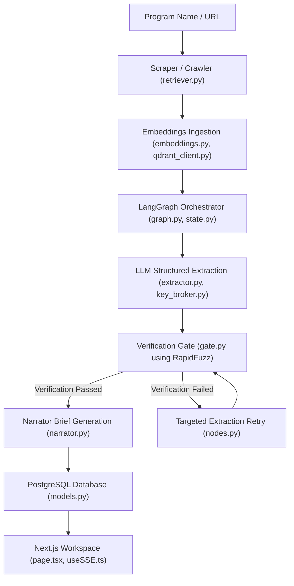

# InfoVac: Autonomous Competitive Intelligence Platform
## Consolidated Hackathon Submission Artifact & Technical Specification

InfoVac is a high-performance, consulting-grade multi-agentic platform built to scrape, extract, verify, analyze, and compare loyalty program architectures. This document provides a unified technical specification of the InfoVac system, aligning it with the hackathon challenge parameters and business requirements.

---

## 📋 Table of Contents
1. **Introduction & Business Context**
2. **System Flow & Architecture**
3. **API Reliability & Key Brokerage**
4. **Structured Ingestion & Classification**
5. **LangGraph Pipeline & Extraction Nodes**
6. **Verification Gate & Confidence Mathematical Models**
7. **Database Models & Alembic Schema Evolution**
8. **Next.js Frontend Architecture & UX Highlights**
9. **Infrastructure, Deployment & Configurations**
10. **Testing, Validation & RAGAS Evaluation**

---

## 🏢 1. Introduction & Business Context

### 🔍 The Problem
In the loyalty industry, competitor auditing is a manual process. Loyalty analysts must comb through hundred-page Terms & Conditions (T&Cs), FAQ pages, benefits guidelines, and press releases to understand, audit, and compare competitor offerings. 

Traditional generic LLM applications fail at this task due to:
1. **Confident Hallucinations**: LLMs frequently invent points-earning rules, rewards tiers, or ratings.
2. **Lack of Grounded Citations**: General chatbots cannot prove *where* a statement was extracted from, making the outputs untrustworthy for consulting-grade reports.
3. **Structured Context Loss**: Naive web scrapers strip layout structures (such as tables), rendering the text illegible.
4. **API Rate-Limiting**: Parallel processing of multiple documents triggers provider rate-limits, crashing typical scripts.

### 💡 The Solution: InfoVac
InfoVac solves this by research-automating loyalty audits. Built around **FastAPI** and **LangGraph** on the backend and **Next.js 15 (React 19)** on the frontend, it crawls the web, extracts structured schemas, verifiably checks quotes, and analyzes strategic advantages. 

### 🏆 Hackathon Challenge & Rubric Alignment
The platform directly aligns with the scoring rubrics in the problem statement [infovac_ps.md](file:///d:/Coding/KOBIE_hackathon/docs/infovac_ps.md):
* **Asymmetric Scoring System**:
  * *Correct Match*: `+1.0` points.
  * *Honest Null (Unknown)*: `+0.5` points.
  * *Miss*: `0.0` points.
  * *Hallucination*: `-3.0` points (highly penalized).
* **Asymmetric Risk Mitigation**: InfoVac prioritizes **precision over recall**. If the Verification Gate rejects a quote, it nullifies the value. An extracted `null` value is rewarded as an *honest null* (`passed=True`, `match_score=1.0`), earning `+0.5` points rather than risking a `-3.0` hallucination penalty.

---

## 🏢 2. System Flow & Architecture

The multi-agent pipeline is orchestrated sequentially as a StateGraph in LangGraph, moving from raw web ingestion to verified output:



---

## 🔑 3. API Reliability & Key Brokerage

Designed to support uninterrupted high-throughput processing by mitigating API failures, rate-limiting, and quota restrictions.

### 🔄 Thread-Safe API Key Broker
* **File Reference**: [key_broker.py](file:///d:/Coding/KOBIE_hackathon/backend/key_broker.py)
* **Mechanics**: Implements a thread-safe load balancer using `threading.Lock` to coordinate parallel checkouts without race conditions.
* **LRU Scheduling**: Tracks the `last_used` timestamp of each key and issues the oldest eligible key to balance API loads.
* **Thread-Local Isolation**: Uses `threading.local()` to register active key usage per thread. If a thread encounters a failure, it isolates and reports that specific key, leaving other threads unaffected.
* **Tiered Cooldown Lockouts**: Automatically locks failed keys for **30 seconds** on transient errors and **1 hour** on rate-limits/exhausted daily quotas (`429` errors).
* **Backpressure Control**: If all keys are in cooldown, the checkout loop uses `time.sleep(0.1)` to block the caller, preventing thread crashes.

### 🔀 Fallback Router Client
* **File Reference**: [llm_client.py](file:///d:/Coding/KOBIE_hackathon/backend/llm_client.py)
* **Mechanics**: Implements the `FallbackClient` wrapper (exposing a standard OpenAI-like `.chat.completions.create` signature).
* **Dynamic Lambda Injection**: Stores connections as `lambda: client_factory()`, checking out active keys from the key broker only when the completion is executed.
* **Pool-Wide Expiry Loops**: Wraps completions in retry loops spanning all configured keys. If a key fails with a quota limit, it is sidelined, and the router checks out the next key instantly.
* **Cross-Provider Failover**: Automatically transitions requests across provider backends if the primary model fails (Gemini ➔ Ollama ➔ Groq ➔ Anthropic ➔ OpenAI).
* **High-Fidelity Error Bubbling**: Catches global key exhaustion states and bubbles mapped JSON errors directly to the Next.js frontend to show alert banners.

---

## 🌐 4. Structured Ingestion & Classification

Handles the crawling, sanitization, and organization of unstructured web pages.

### 🕷️ Multi-Query Web Scraper Grid
* **File Reference**: [retriever.py](file:///d:/Coding/KOBIE_hackathon/backend/retriever.py)
* **Targeted Ingestion**: Spawns **11 targeted queries** mapped to specific loyalty program aspects (e.g., FAQs, partner lists, T&C documents) instead of running a single generic search query.
* **Robots.txt Parser Integration**: Checks target websites' `robots.txt` before crawling. If a check times out, it marks the source as `robots_unverified` and continues, avoiding blocks or script failures.
* **Mojibake Ingestion Cleanup**: Automatically resolves double-decoding artifacts (e.g., converting `’` back to `’` and `é` to `é`), improving verbatim quotation checks.

### 🏷️ Zero-Token Source Classifier
* **File Reference**: [classifier.py](file:///d:/Coding/KOBIE_hackathon/backend/classifier.py)
* **Deterministic Classification**: Categorizes crawled URLs into types (e.g., `tnc`, `faq`, `press`, `forum`) without incurring LLM token costs.
* **4-Stage Regex Priority Chain**:
  1. *Trusted Domains*: Identifies specific sites (e.g., app stores, forums).
  2. *URL Paths*: Searches for keywords (e.g., `/terms`, `/legal`, `.pdf`).
  3. *Title Keywords*: Scans search engine headers.
  4. *Snippet Fallbacks*: Parses text snippets for legal keywords (e.g., *"shall not"*, *"pursuant to"*).

---

## ⚙️ 5. LangGraph Pipeline & Extraction Nodes

### 📦 Pipeline State & Iterators
* **File Reference**: [state.py](file:///d:/Coding/KOBIE_hackathon/orchestrator/state.py)
* **Role**: Defines the shared state flowing through the LangGraph StateGraph nodes.
* **Typing Constraint**: Employs a strict `TypedDict` to enforce JSON-serializable keys (preventing connection memory leaks by forbidding raw SQLAlchemy ORM objects):
  ```python
  class PipelineState(TypedDict):
      program_id: str            # UUID string representation
      program_name: str          # Name of loyalty program
      source_dicts: list[dict]   # Serialised crawled source properties
      extracted_schema: Optional[dict]  # Extracted values schema dictionary
      error: Optional[str]       # Error message string
      retry_count: int           # Current retry attempts
  ```
* **Iterators**: Provides `iter_fields(schema_dict)` to flatten nested Pydantic models into dynamic generators returning `(category_key, field_name, value_dict)`.

### 🕸️ LangGraph Orchestrator
* **File Reference**: [graph.py](file:///d:/Coding/KOBIE_hackathon/orchestrator/graph.py)
* **Nodes**:
  * `retrieve` ➔ `embed` ➔ `extract` ➔ `verify` ➔ `narrate` ➔ `END`.
* **LangSmith trace sharing**:
  * Uses `collect_runs()` context managers to intercept the pipeline run ID.
  * Dynamically creates a shareable link via `Client().share_run(run_id)`.
  * Triggers database updates to persist the trace link (`programs.trace_url`) for the Next.js frontend workspace view.

### ⚙️ Node Execution Details
Each node in [nodes.py](file:///d:/Coding/KOBIE_hackathon/orchestrator/nodes.py) handles its own exceptions, logs diagnostic traces, updates status rows in PostgreSQL, and emits frontend events.

#### A. Ingestion: `retrieve_node`
* **Workflow**: Dispatches crawler pipelines.
* **Resilience**: Employs `tenacity.AsyncRetrying` with **3 attempts** and exponential backoffs ($1 \text{s} \rightarrow 8 \text{s}$) to absorb transient timeouts from search engines or scraping tools.
* **State Updates**: Maps crawled ORM models to `source_dicts` containing truncated contents (`raw_content` capped at 50,000 chars, `raw_html` capped at 30,000 chars).

#### B. Vector Ingestion: `embed_node`
* **Workflow**: Groups raw contents into chunks, compiles Google dense vector embeddings, fits local TF-IDF matrices for Qdrant sparse vectors, and upserts them into Qdrant using hybrid models.
* **Timeout Protections**: Upserts vectors in batches of 100 with a **45-second execution timeout** (`asyncio.wait_for`). If vector database uploads hang, it emits a warning but continues execution to prevent pipeline freezes.

#### C. Extraction: `extract_node`
* **Workflow**: Feeds crawled sources into Pydantic structured schemas.
* **Execution**: Wraps the blocking Instructor extraction pipeline in a thread-pool executor (`loop.run_in_executor`) to prevent blocking the main asyncio event loop.

#### D. Citation Check & Retry: `verify_node`
This is a critical node in the platform:
1. **Verbatim Gate**: Validates quotes via `gate_verify_multi_source` across all crawled sources.
2. **Attribution Recovery**: Re-allocates facts to the correct source URL if the LLM quoted correct text but cited the wrong URL.
3. **LLM Judge Borderline Verification**: If matching scores land in the borderline range $[0.70, 0.94]$, it triggers `_call_llm_judge` to determine if semantic/formatting variances are acceptable.
4. **Targeted Failover Retries**: Gathers all fields that failed verification and executes a second extraction pass (`retry_failed_fields`) targeting only those values.
5. **Coordinate Indexing**: Performs text index lookups (`src_content.find(quote)`) to register exact character coordinates (`citation_start` and `citation_end`) in PostgreSQL.
6. **Financial Bookkeeping**: Calculates LLM token costs (`extraction_cost` + `retry_cost`) and saves them in `program.total_cost`.

#### E. Executive Narrative: `narrate_node`
* **Workflow**: Generates Markdown consulting briefs based on verified database fields, appending the narrative to the database.

---

## 🛡️ 6. Verification Gate & Confidence Mathematical Models

### 🔬 Verification Gate
* **File Reference**: [gate.py](file:///d:/Coding/KOBIE_hackathon/backend/gate.py)
* **Composite Quote Splitting**: Handles composite quotes (e.g., divided by ellipses `...` or brackets `[]`) by splitting and validating each segment independently.
* **Weakest-Link Match Principle**: Applies the minimum score among all segments as the final match score, blocking partial hallucinations.
* **Attribution Recovery**: Scans all crawled documents if the LLM attributes a fact to the wrong source, re-assigning it to the correct URL and source ID.
* **Majority-Vote Attribution**: Selects the source page containing the highest count of verified segments for composite quotes.

### 📊 Confidence & Contradiction Resolution
* **File Reference**: [verifier.py](file:///d:/Coding/KOBIE_hackathon/backend/verifier.py)
* **Credibility Formula**: Computes a deterministic score:
  $$\text{Confidence} = 0.5 \times \text{Corroboration} + 0.3 \times \text{Authority} + 0.2 \times \text{Recency}$$
* **Recency Sigmoid Decay**: Applies a decay curve to the source timestamp. Fresh sources (<30 days) receive a `1.0` multiplier; old sources decay down to a `0.3` floor.
* **Contradiction Capping**: Performs pairwise similarity checks across all gate-verified values for a single parameter. If disagreement is detected (similarity <65%), it flags a contradiction and caps the confidence score at `0.4` to signal a manual review.

---

## 💾 7. Database Models & Alembic Schema Evolution

### 🏗️ SQLAlchemy ORM Models (`backend/models.py`)
* **File Reference**: [models.py](file:///d:/Coding/KOBIE_hackathon/backend/models.py)
* **Program**: Core table tracking loyalty programs, running states, and API costs.
* **Source**: Maps fetched pages, content hashes, and raw HTML payloads.
* **ExtractedField**: Fields category grid, matching scores, character offsets, and verifier metrics.
* **PipelineEvent**: Table tracking pipeline event inserts.
* **Narrative**: Holds generated Markdown brief contents.
* **Comparison**: Mapped comparisons columns holding JSONB strategic matrix data.
* **Conversation & Message**: Persistent schemas for chat turns.

### ⏳ Alembic Migration History
* **env.py Configuration**: [env.py](file:///d:/Coding/KOBIE_hackathon/alembic/env.py) dynamically overrides URL connections from environment variables and uses `NullPool` to prevent connection leaks during migrations.
* **Migration Versions**:
  * `0001`: Initial schema base defining all 9 tables.
  * `f488ae1af2aa`: Conversation & Message schemas upgrade, creating relational chat history tables.
  * `0002_add_raw_html`: Adds `raw_html` to `sources` to store raw HTML pages (up to 80K chars) for table extraction.
  * `0003_citation_offsets`: Adds `citation_start` and `citation_end` coordinates to `extracted_fields`.
  * `0004_add_total_cost`: Adds `total_cost` to `programs` to track API costs.
  * `0005_support_multi_compare`: Drops unique constraints on `extracted_fields` to enable append-only historical runs. Adds `program_ids` JSONB column to support comparisons with more than 2 programs.
  * `0006_add_trace_url`: Adds `trace_url` to `programs` to store LangSmith share links.

---

## 🎨 8. Next.js Frontend Architecture & UX Highlights

The Next.js 15 (React 19) frontend follows Kobie brand guidelines, utilizing a dark, high-density dashboard aesthetic.

### A. Color Palette & Typography (defined in [globals.css](file:///d:/Coding/KOBIE_hackathon/frontend/app/globals.css))
* **Midnight (`#051c2c`)**: Core page background.
* **Ocean (`#092538`)**: Card backgrounds and container layouts.
* **Coral (`#fd7f4f`)**: Action highlights, buttons, and citations.
* **Lavender (`#5461c9`)**: Hover states.
* **Typography**: `Inter` for headings and `Roboto` for body text.

### B. Workspace Pages & Views
* **Analyst Workspace (`frontend/app/page.tsx`)**: Integrates multi-program grid modes, relative timestamp formatting, and fuzzy cache interception.
* **Admin Dashboard (`frontend/app/admin/page.tsx`)**: Renders aggregate metrics (verification ratios, token costs) and hosts the comparator program picker.

### C. Technical Component Specs
* **Autocomplete Input (`ProgramInput.tsx`)**: Uses a `200ms` debounce timer and handles up to 5 concurrent inputs.
* **Live SSE Progress Tracker (`PipelineTracker.tsx`)**: Renders progress circles via EventSource and fetches domain favicons dynamically.
* **Brief View & Citation Highlighter (`BriefView.tsx` & `EvidenceDrawer.tsx`)**:
  * *Deferred Rendering*: Mounts instantly with a loading spinner, delaying markdown compilation by `50ms` to prevent browser paint freezing.
  * *LCS Optimization*: Uses a **Dynamic Programming Longest Common Substring (LCS)** matrix scan, reducing search latency from 3 seconds to under 15ms.
  * *Highlight Injector*: Uses character coordinates to wrap cited quotes in yellow `<mark>` blocks.
* **Consolidated PDF Exporter (`ExportBar.tsx`)**: Compiles PDFs with Kobie SVG headers repeating across page breaks, separate narrative and references page slots, and a centered horizontal rule watermark.

---

## 🚀 9. Infrastructure, Deployment & Configurations

### A. Containerization Specification
* **FastAPI Backend (`Dockerfile`)**:
  * [Dockerfile](file:///d:/Coding/KOBIE_hackathon/Dockerfile) implements a **two-stage build**:
    * *Stage 1 (Builder)*: Installs compilation tools and builds dependencies in `/opt/venv`.
    * *Stage 2 (Runner)*: Copies the virtual environment into a slim image, excluding build tools to minimize package size.
  * Includes a container health check command that polls port 8000 every 10 seconds.
* **Service Orchestrations (`docker-compose.yml`)**:
  * [docker-compose.yml](file:///d:/Coding/KOBIE_hackathon/docker-compose.yml) configures a named Docker volume (`postgres_data`) for data persistence.
  * Defines a `depends_on` health condition to delay the FastAPI server boot until PostgreSQL is healthy.

### B. Dependency Tuning & Packaging
* **Requirements Optimizations**:
  * [requirements-deploy.txt](file:///d:/Coding/KOBIE_hackathon/requirements-deploy.txt) overrides default package indices for PyTorch CPU-only builds:
    ```txt
    --extra-index-url https://download.pytorch.org/whl/cpu
    torch
    sentence-transformers
    ```
    This reduces the container size by **~800MB**, accelerating download and deploy times.

### C. Process Lifecycle & Shutdown Traps
* **start.ps1 Launcher**:
  * The PowerShell wrapper launcher saves process handles (`-PassThru`) for FastAPI, Next.js, and Docker daemons.
  * When intercepting termination signals (`Ctrl+C`), a recursive `finally` block executes `taskkill /f /t /pid`, cleanly stopping all child processes and closing spawned console windows to prevent zombie processes.

---

## 🧪 10. Testing, Validation & RAGAS Evaluation

### A. Testing Strategy
* **Pytest Fixtures (`tests/conftest.py`)**:
  Uses `NullPool` engines to prevent async loop connection errors caused by `pytest-asyncio` creating new loops per test function.
* **Comprehensive Integration Suite (`test_comprehensive_system.py`)**:
  Runs the entire multi-agent pipeline from search queries to narrative output in **9 seconds** by mocking external API dependencies.
* **Orchestrator Unit Tests (`test_orchestrator_unit.py`)**:
  Verifies StateGraph node transitions. Asserts that retrieve failures trigger error updates and short-circuit downstream tasks to conserve API key usage.
* **Algorithmic Unit Tests (`test_verifier.py` & `test_gate.py`)**:
  Validates confidence calculations, recency decay curves, pairwise contradiction caps, fuzzy thresholds, and verbatim null passing.

### B. Automated RAGAS Evaluation Suite (`tests/eval_ragas.py`)
* **File Reference**: [eval_ragas.py](file:///d:/Coding/KOBIE_hackathon/tests/eval_ragas.py)
* **Golden QA Dataset Generation**: Auto-generates evaluation datasets dynamically:
  1. Fetches all gate-passed, non-null fields for a program.
  2. Maps them to natural-language question templates (e.g., `expiry_policy` ➔ *"When do points expire in this loyalty program?"*).
  3. Uses the gate-verified value and evidence quote as the Ground Truth.
  4. Generates chatbot answers and collects retrieved contexts.
  5. Evaluates using Gemini or GPT-4o-mini as a judge.
* **RAGAS Quality Metrics**: Measures chatbot quality across:
  * **Faithfulness**: Verifies answers stick to retrieved contexts (target $\geq 0.70$).
  * **Answer Relevancy**: Verifies answers address user queries (target $\geq 0.60$).
  * **Context Precision**: Measures chunk usefulness (target $\geq 0.60$).
  * **Context Recall**: Verifies retrieval success (target $\geq 0.60$).
