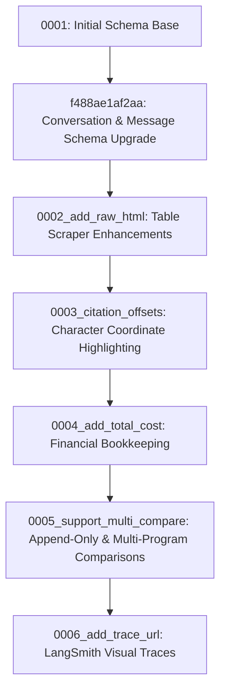

# Part 7: Database Models & Alembic Migration Specification

This document details the persistence layer of InfoVac. It covers the SQLAlchemy ORM models, database trigger mechanics, and the step-by-step evolution of the schema through Alembic migrations.

---

## 🗄️ 1. Database Architecture & Design Rationale

InfoVac uses PostgreSQL for data persistence, employing several architectural design patterns:
* **Append-Only Parameter Tracking**: Since revision `0005`, the database has operated in an append-only mode for field extractions. Instead of overwriting existing parameters, every pipeline run appends new `ExtractedField` records. This preserves the historical dataset of loyalty program changes over time, enabling the **Program Evolution** diff analysis.
* **JSONB Semi-Structured Storage**: Utilized for comparison matrices (`analysis_json`) and dynamic program lists (`program_ids`), allowing structured layouts to be queried without complex joins.
* **Cascading Purges (`ON DELETE CASCADE`)**: Configured on foreign keys so that purging a program automatically cascades to delete dependent sources, fields, narratives, events, and chat history.
* **pg_notify Event Trigger**: Bypasses secondary message brokers by binding a PostgreSQL trigger on the `pipeline_events` table. When the LangGraph pipeline inserts an event row, the database broadcasts it directly to listening FastAPI SSE threads.

---

## 🏗️ 2. SQLAlchemy ORM Models (`backend/models.py`)

* **File Reference**: [models.py](file:///d:/Coding/KOBIE_hackathon/backend/models.py)

### A. `Program`
The root model tracking loyalty programs and their runs:
* `id` (UUID): Primary key.
* `name` (String(255)): Program identifier (e.g., *"Starbucks Rewards"*).
* `status` (String(50)): Run state (`pending`, `retrieving`, `embedding`, `extracting`, `verifying`, `narrating`, `complete`, `failed`).
* `llm_used` (String(50)): LLM model configuration.
* `schema_version` (String(10)): Version tracking.
* `created_at` / `completed_at` (DateTime): Run timestamps.
* `error_message` (Text): Holds execution error details if status is `failed`.
* `total_cost` (Numeric(8,4)): Cumulative cost tracking in USD.
* `trace_url` (Text): LangSmith shareable trace URL.

### B. `Source`
Tracks crawled web pages:
* `id` (UUID): Primary key.
* `program_id` (UUID): ForeignKey referencing `programs.id` with `ON DELETE CASCADE`.
* `url` (Text): Original crawled page URL.
* `source_type` (String(50)): Classification (`homepage`, `faq`, `tnc`, `app_review`, `press`, `forum`).
* `title` (Text): Extracted HTML page title.
* `raw_content` (Text): Cleaned web page text (capped at 50,000 chars in state).
* `raw_html` (Text): raw HTML layout (capped at 30,000 chars) used for HTML table parsing.
* `content_hash` (String(64)): SHA-256 hash of `raw_content` used to avoid redundant extractions.
* `fetch_method` (String(20)): Crawler backend used (`firecrawl` or `tavily_snippet`).
* **Constraints**: `UniqueConstraint("program_id", "url")` ensures no duplicate URLs are ingested per program.

### C. `ExtractedField`
Stores extracted parameter values:
* `id` (UUID): Primary key.
* `program_id` (UUID): ForeignKey referencing `programs.id` with `ON DELETE CASCADE`.
* `category` (String(50)) / `field_name` (String(100)): Schema category and parameter name.
* `field_value` (JSONB): The structured value.
* `is_null` (Boolean): Flag indicating if the parameter is null.
* `claimed_snippet` (Text): Verbatim evidence quote cited by the LLM.
* `gate_passed` (Boolean): Verification status.
* `match_score` (Numeric(4,3)): Verification match score.
* `citation_start` / `citation_end` (Integer): Character offsets of the quote within `Source.raw_content` for UI highlighting.
* `confidence` / `corroboration_score` / `authority_score` / `recency_score` (Numeric): Metrics computed by [verifier.py](file:///d:/Coding/KOBIE_hackathon/backend/verifier.py).
* `source_id` (UUID): ForeignKey referencing `sources.id`.
* `contradiction_flag` (Boolean) / `contradiction_note` (Text): Contradiction audit flags.

### D. `PipelineEvent`
Stores progress events:
* `id` (BIGSERIAL): Primary key.
* `program_id` (UUID): ForeignKey referencing `programs.id` with `ON DELETE CASCADE`.
* `stage` (String(50)): Pipeline stage.
* `progress` (String(10)): Decimal progress string (e.g., `"0.25"`).
* `detail` (Text): Progress description.

### E. `Narrative`
Analyst brief outputs:
* `id` (UUID): Primary key.
* `program_id` (UUID): ForeignKey referencing `programs.id` with `ON DELETE CASCADE`.
* `narrative_text` (Text): Compiled Markdown brief.
* `word_count` (Integer): Brief word count.

### F. `Comparison`
Multi-program comparison storage:
* `id` (UUID): Primary key.
* `program_ids` (JSONB): Mapped list of UUIDs comparing up to 5 programs in parallel.
* `analysis_json` (JSONB): Structured comparison metrics matrix.

### G. `Conversation` & `Message`
RAG chatbot history:
* `Conversation.program_id`: ForeignKey referencing `programs.id` with `ON DELETE CASCADE`.
* `Message.conversation_id`: ForeignKey referencing `conversations.id` with `ON DELETE CASCADE`.
* `Message.role` (String(50)): Chat role (`user` or `assistant`).
* `Message.content` (Text): Message text.

---

## ⏳ 3. Alembic Migration History & Specs

The database schema has evolved through a structured timeline of migrations:

### Revision 0001: Initial Schema Base
* **File**: `alembic/versions/0001_initial_schema.py`
* **Changes**:
  * Enables the `pgcrypto` PostgreSQL extension to support uuid generation.
  * Creates core tables: `programs`, `sources`, `extracted_fields`, `narratives`, `comparisons`, `pipeline_events`, and `eval_ground_truth`.
  * Registers trigger function `notify_pipeline_event()` and binds `trg_pipeline_event` to execute `pg_notify` on pipeline inserts.

### Revision `f488ae1af2aa`: Conversation & Message Schema Upgrade
* **File**: `alembic/versions/f488ae1af2aa_add_conversation_and_message_models.py`
* **Changes**:
  * Drops the basic conversations table.
  * Creates relational chat history tables (`conversations` and `messages`), linking conversation sessions to programs and message turns to conversations with cascade purges.

### Revision `0002_add_raw_html`: Table Scraper Enhancements
* **File**: `alembic/versions/0002_add_raw_html.py`
* **Changes**:
  * Adds `raw_html` TEXT column to `sources` table to store up to 80K characters of raw HTML. This preserves structure for the parser to extract complex tables.

### Revision `0003_citation_offsets`: Character Coordinate Highlighting
* **File**: `alembic/versions/0003_citation_offsets.py`
* **Changes**:
  * Adds `citation_start` and `citation_end` INTEGER columns to `extracted_fields`. Used to store character coordinates of evidence quotes to enable highlight overlays in the frontend drawer.

### Revision `0004_add_total_cost`: Financial Bookkeeping
* **File**: `alembic/versions/0004_add_total_cost.py`
* **Changes**:
  * Adds `total_cost` NUMERIC(8,4) column to `programs` table to track LLM API consumption cost in USD.

### Revision `0005_support_multi_compare`: Append-Only History & Multi-Compare
* **File**: `alembic/versions/0005_support_multi_compare.py`
* **Changes**:
  * **Drops Unique Constraint**: Removes `extracted_fields_program_id_field_name_key` to transition extraction history to an append-only structure.
  * **Multi-Compare Migration**: Removes `NOT NULL` constraints from `program_a_id` and `program_b_id` in `comparisons`. Adds `program_ids` JSONB column to support comparisons with more than 2 programs.

### Revision `0006_add_trace_url`: LangSmith Visual Traces
* **File**: `alembic/versions/0006_add_trace_url.py`
* **Changes**:
  * Adds `trace_url` TEXT column to `programs` table to store public LangSmith execution traces.

---

## 🔧 4. Migrations Configuration (`alembic/env.py`)

* **File Reference**: [env.py](file:///d:/Coding/KOBIE_hackathon/alembic/env.py)

Alembic utilizes a custom environment configuration to integrate migrations with the application context:
* **Dynamic Connection Binding**: Imports `SYNC_DATABASE_URL` from variables to override the static URL in `alembic.ini`.
* **Zero Connection Leakage**: Configures `poolclass=pool.NullPool` in `run_migrations_online()`. This avoids connection pooling issues, ensuring that the Alembic migration process releases database connections immediately upon completion.
