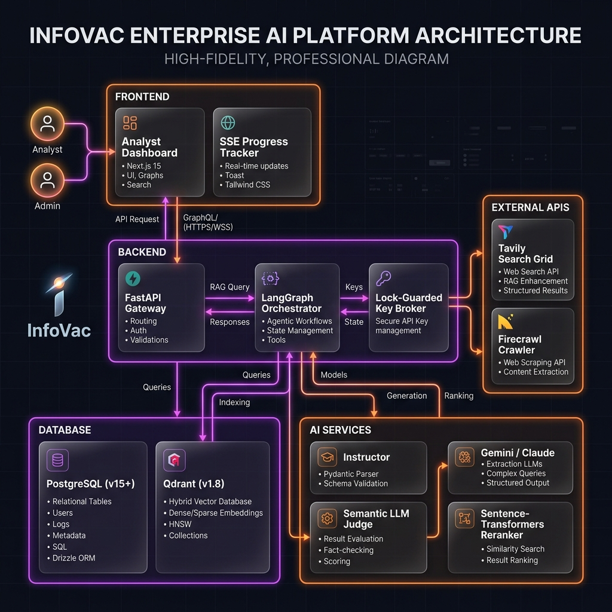
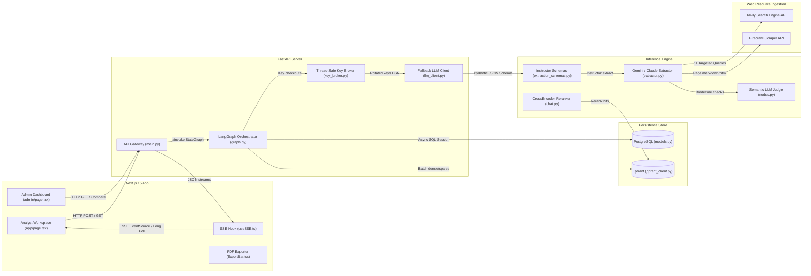

# InfoVac: System Architecture Diagram & Component Overview

This document presents the structural and data flow design of the InfoVac platform, illustrating how data propagates across the 5 architectural layers: **Frontend ➔ Backend ➔ Databases ➔ AI Services ➔ External APIs**.



---

## 🏢 1. Concept Map: The 5-Layer Stack

```
   ┌─────────────────────────────────────────────────────────────┐
   │ 1. FRONTEND: Next.js 15 (App Workspace, SSE progress logs)  │
   └───────────────┬─────────────────────────────▲───────────────┘
                   │ HTTP API Requests           │ Server-Sent Events (SSE)
                   ▼                             │
   ┌─────────────────────────────────────────────┴───────────────┐
   │ 2. BACKEND: FastAPI Gate, LangGraph state, Key Broker      │
   └───────────────┬─────────────────────────────┬───────────────┘
                   │ SQL Queries                 │ Semantic Queries
                   ▼                             ▼
   ┌─────────────────────────────┐ ┌─────────────────────────────┐
   │ 3. DATABASES: PostgreSQL    │ │ 3. DATABASES: Qdrant Vector │
   └───────────────┬─────────────┘ └─────────────┬───────────────┘
                   │ LLM prompts / schemas       │ Vector chunks
                   ▼                             ▼
   ┌─────────────────────────────────────────────────────────────┐
   │ 4. AI SERVICES: Instructor, Gemini/Claude, rerank models    │
   └─────────────────────────────┬───────────────────────────────┘
                                 │ Ingestion requests
                                 ▼
   ┌─────────────────────────────────────────────────────────────┐
   │ 5. EXTERNAL APIS: Tavily Search Grid & Firecrawl Crawlers   │
   └─────────────────────────────────────────────────────────────┘
```

---

## 🕸️ 2. Detailed Component Mermaid Diagram

This diagram maps the components, directories, and communication protocols connecting the layers:



---

## 📝 3. Architectural Component Layer Descriptions

### 1. Frontend Layer (`frontend/`)
* **Analyst Dashboard**: The main interface. Uses deferred rendering (`isReady` states) to parse heavy Markdown narratives without locking the browser's thread.
* **LCS Text Resolver**: Employs a 15ms dynamic programming algorithm in TypeScript to resolve citations.
* **PDF Exporter**: Renders compiled, multi-page vector-layout PDF files client-side using `@react-pdf/renderer`.
* **SSE Listener**: Receives live event payloads from FastAPI streams. If connections fail, it automatically downgrades to a 10s HTTP polling loop.

### 2. Backend Layer (`backend/` & `orchestrator/`)
* **FastAPI Router**: Serves endpoints, CORS rules, and SSE streams linked to PostgreSQL database triggers.
* **LangGraph Orchestrator**: Manages execution state through five nodes (`retrieve` ➔ `embed` ➔ `extract` ➔ `verify` ➔ `narrate`), utilizing LangSmith tracing context managers.
* **API Key Broker**: A lock-guarded resource balancer that manages rate limits (30s cooldowns, 1h daily quota lockouts) during parallel tasks.

### 3. Database Layer (SQL & Vector)
* **PostgreSQL (15-alpine)**: Stores structured tables (`programs`, `sources`, `extracted_fields`, `narratives`, etc.) under an append-only transaction layout. Implements a database-level notification trigger (`trg_pipeline_event`).
* **Qdrant Vector DB**: Houses dense embeddings (3072 dimensions) and sparse vector payloads. Auto-reconciles collection configurations on boot.

### 4. AI Services Layer
* **Instructor Client**: Enforces structured Pydantic extractions.
* **Semantic LLM Judge**: Performs fact-checking when fuzzy verification scores land in the borderline range $[0.70, 0.94]$.
* **CrossEncoder Reranker**: Employs `bge-reranker-base` to rerank semantic search hits for the RAG chatbot.

### 5. External APIs Layer
* **Tavily API**: Executes a multi-query search grid (11 queries) to discover program sources.
* **Firecrawl API**: Crawls web pages and extracts raw markdown and raw HTML tables.
