# InfoVac: System Flows, User Journeys & Database ER Diagrams

This document contains the structural flows, user journeys, data pipelines, and relationship schemas of the InfoVac platform.

---

## 📋 Table of Contents
1. **Data Flow Diagram (DFD)** (How data moves: User ➔ UI ➔ API ➔ AI ➔ DB ➔ Response)
2. **User Flow Diagram** (User journey: Onboard ➔ Workspace ➔ Audits ➔ Results)
3. **Database Entity Relationship Diagram (ERD)** (Table entities & relations)
4. **AI Agent Workflow** (Orchestration: Request ➔ Orchestrator ➔ Agent ➔ Verification ➔ Response)

---

## 🔄 1. Data Flow Diagram (DFD)

This DFD maps how a search query or a program extraction request propagates through the layers and returns processed results.

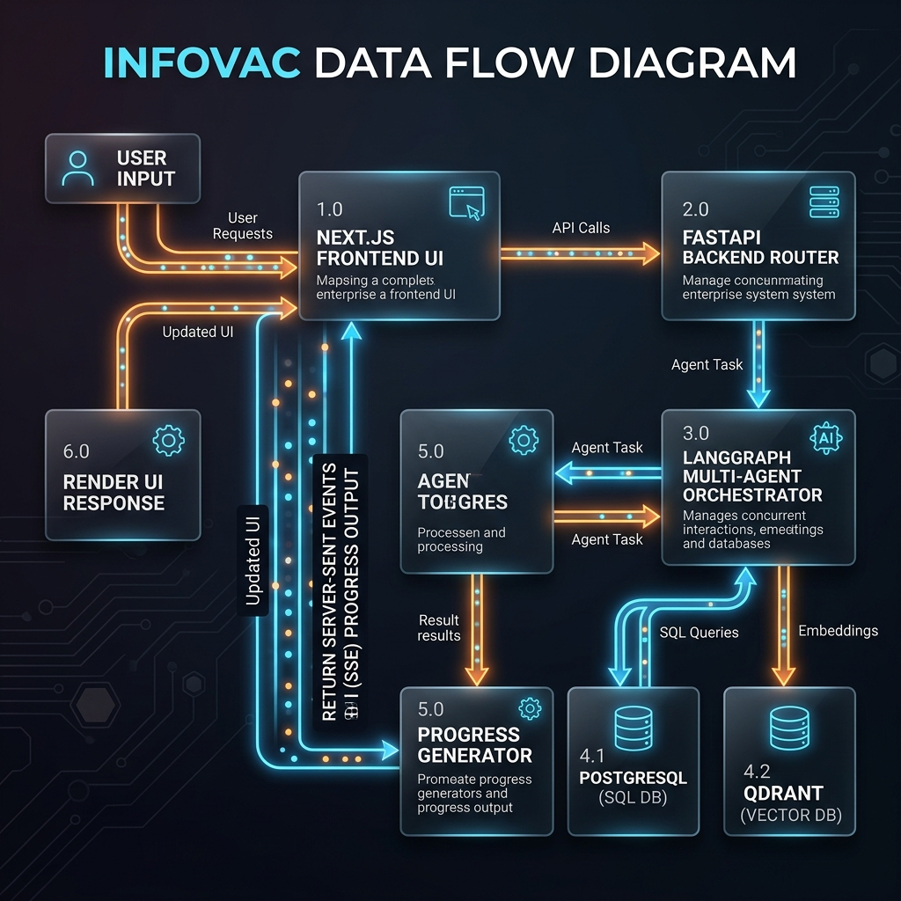

```mermaid
graph TD
    User["👤 User (Analyst)"] -->|1. Triggers Audit (Brand Name / URLs)| FE["💻 Next.js Frontend"]
    FE -->|2. HTTP POST /api/v1/programs| BE["⚙️ FastAPI Backend (main.py)"]
    BE -->|3. Dispatches Task to LangGraph| Graph["🕸️ LangGraph Orchestration"]
    
    Graph -->|4. Search queries grid| Crawler["🕷️ Scraper Grid (retriever.py)"]
    Crawler -->|5. Raw Web Markdown / HTML| Graph
    
    Graph -->|6. Dense/Sparse Vector upsert| Qdrant[("🔍 Qdrant Vector Store")]
    Graph -->|7. Structured Extraction prompts| LLM["🤖 LLM Services (Instructor / LLM Client)"]
    LLM -->|8. Parsed structured dictionary| Graph
    
    Graph -->|9. Fuzzy Quote Check| Verifier["🛡️ Verifier & Gate (gate.py / verifier.py)"]
    Verifier -->|10. Verified facts & confidence scores| Graph
    
    Graph -->|11. SQL commits (append-only parameters)| DB[("🗄️ PostgreSQL Database")]
    DB -->|12. Triggers pg_notify| Notification["📢 pg_notify trigger event"]
    Notification -->|13. Server-Sent Events (SSE stream)| FE
    FE -->|14. Renders live progress and visual highlights| User
```

---

## 🗺️ 2. User Flow Diagram (User Journey)

Maps the steps an analyst takes to onboard, discover programs, audit details, ask chat queries, and generate comparisons.

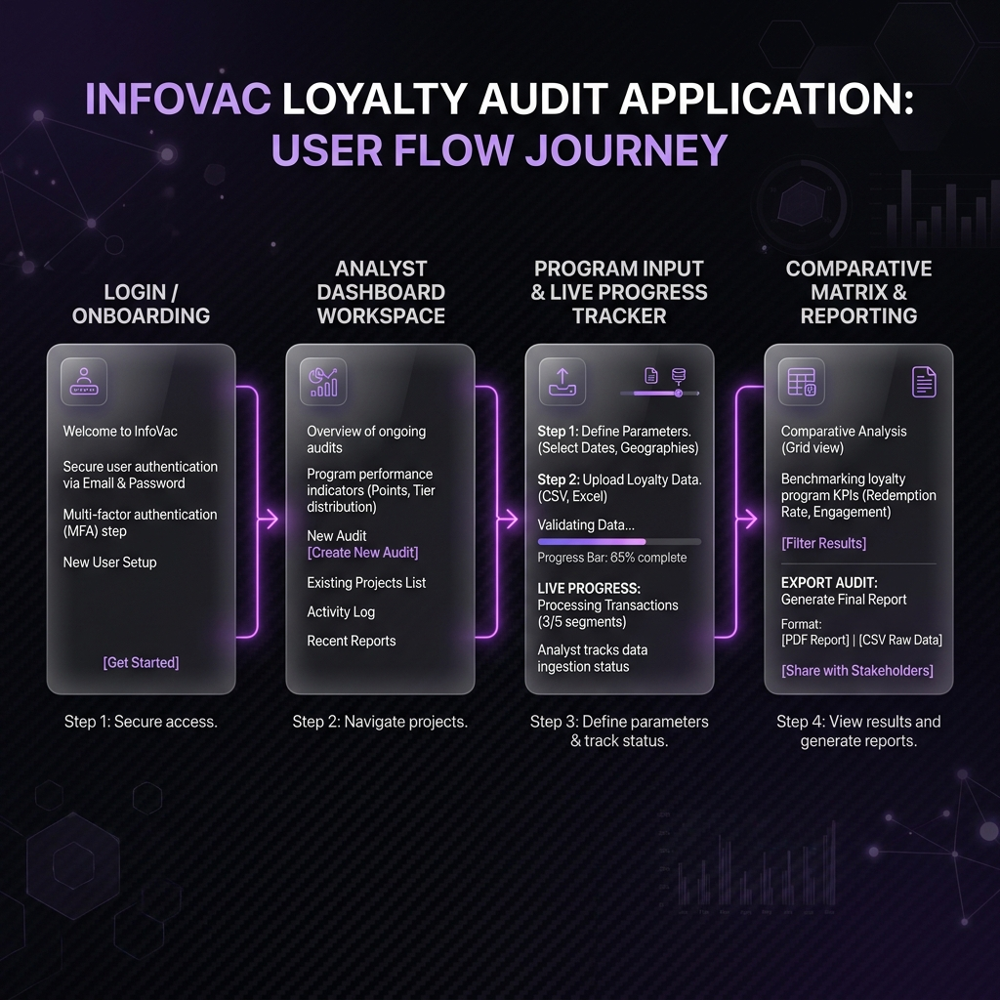

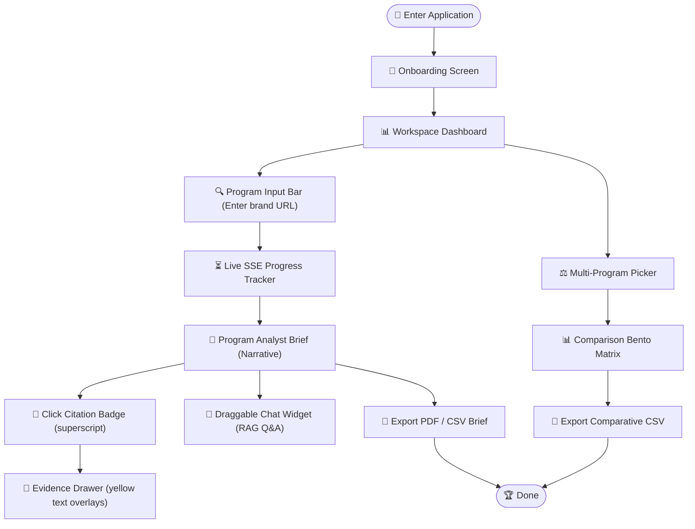

---

## 🗄️ 3. Database Entity Relationship Diagram (ERD)

The relational schema defined in [models.py](file:///d:/Coding/KOBIE_hackathon/backend/models.py). It models the cascade deletes and data types.

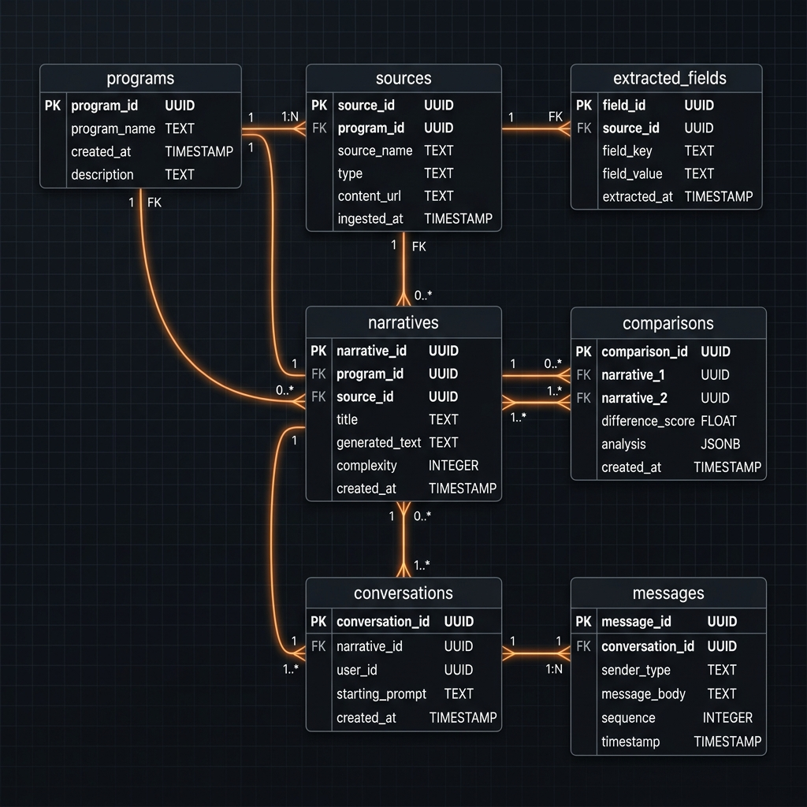

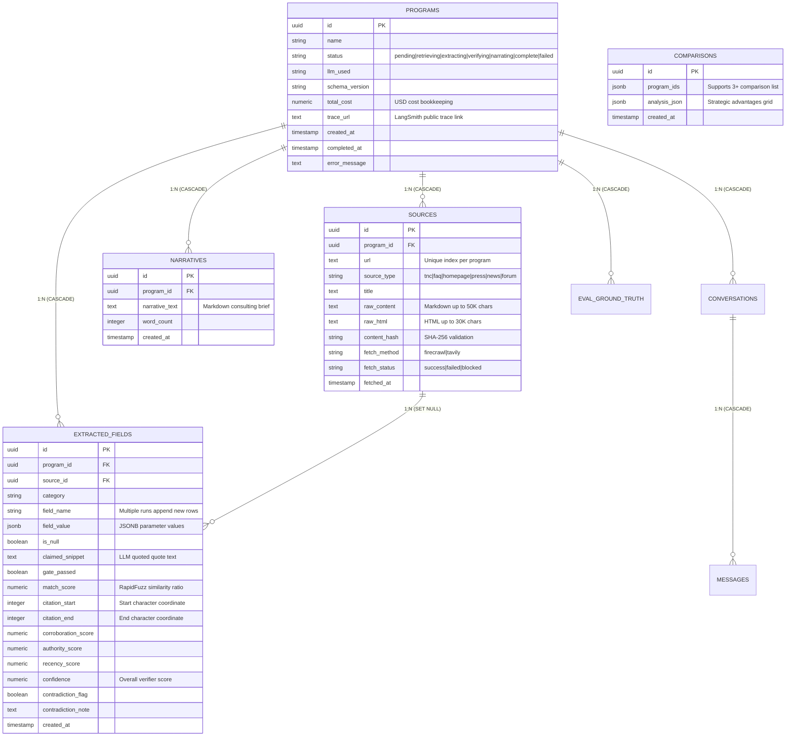

---

## 🤖 4. AI Agent Workflow Diagram

InfoVac's LangGraph multi-agent flow. It maps the state boundaries, validation loops, and LLM-as-a-judge override thresholds.

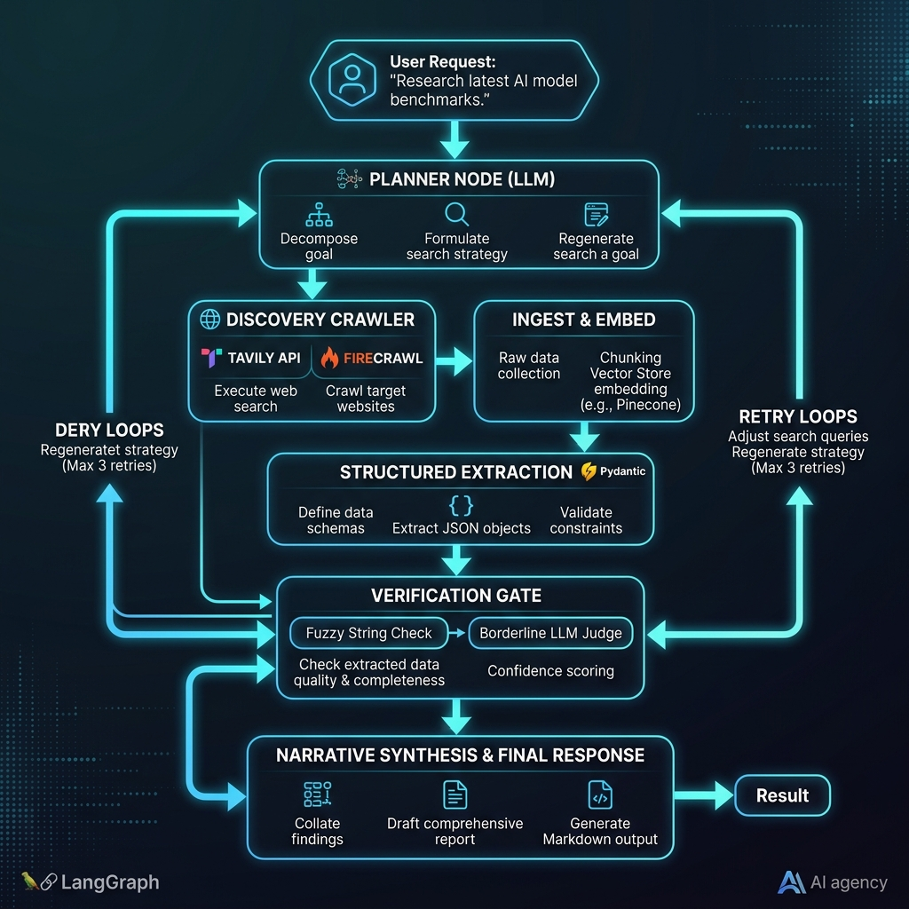

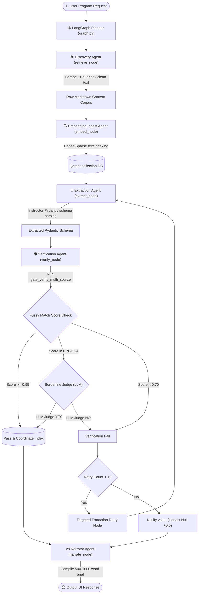

---

## 🧩 5. Component Diagram

Maps the logical components of the platform and their package-level boundaries.

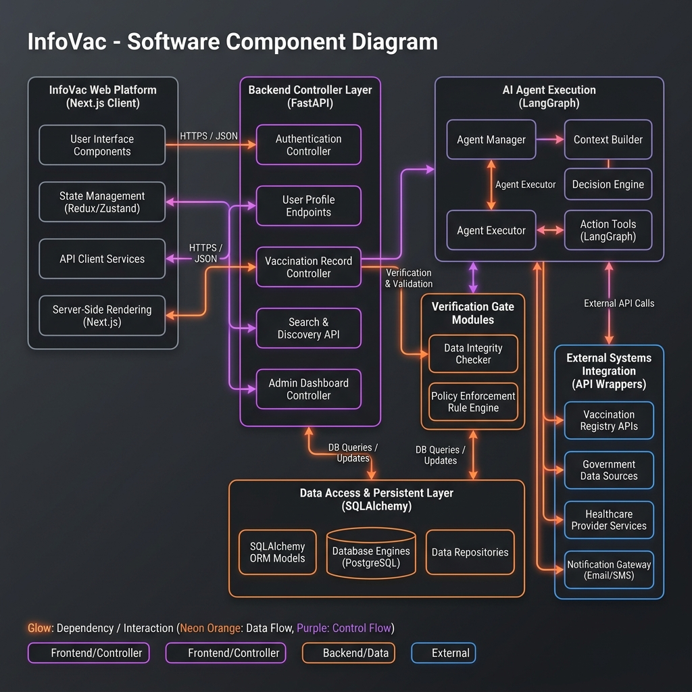

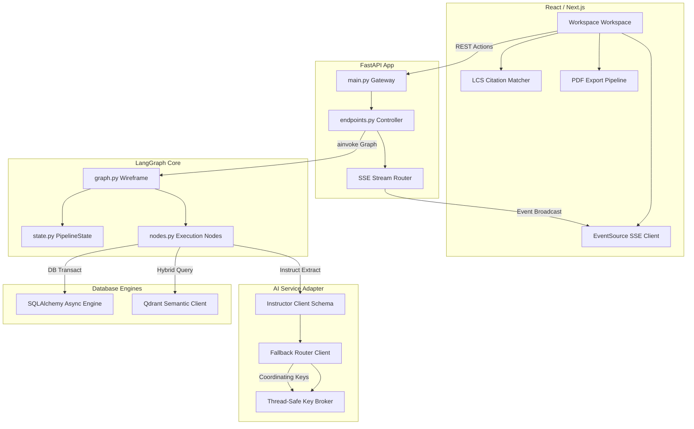

---

## 📡 6. Deployment Diagram

Maps the containerization host networks and runtime volumes mapping.

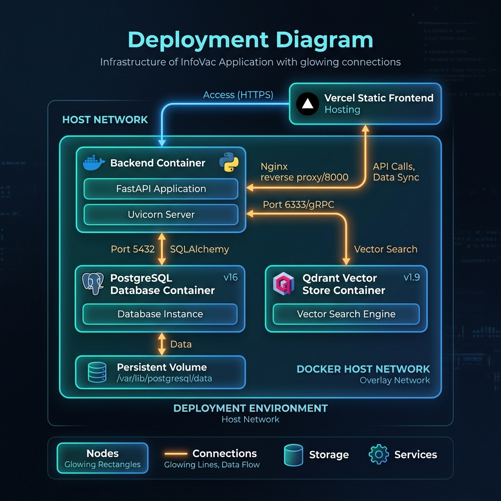

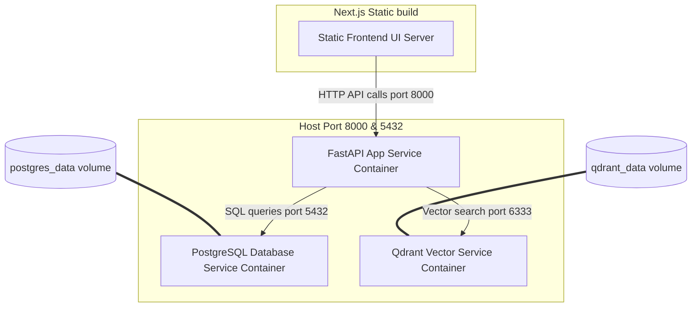

---

## 📡 7. Sequence Diagram

Illustrates the chronologically ordered lifecycle of a loyalty program audit task run.

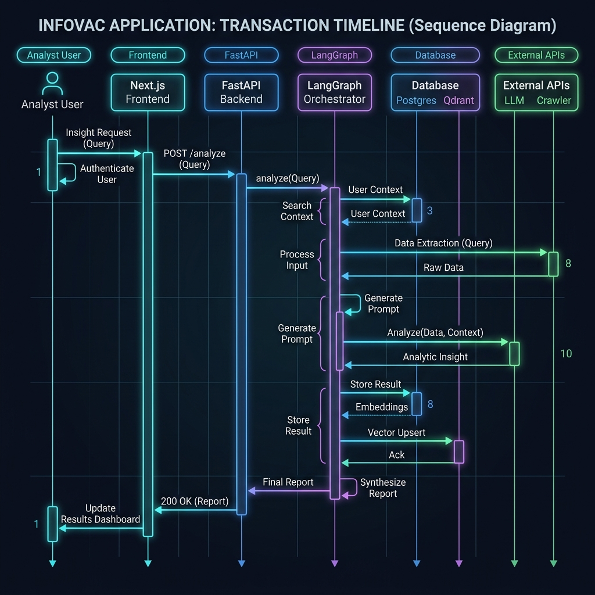

```mermaid
sequenceDiagram
    actor Analyst as User (Analyst)
    participant UI as Next.js Frontend
    participant API as FastAPI Backend
    participant Graph as LangGraph Orchestrator
    participant DB as Postgres Database
    participant LLM as LLM Provider / Scraper

    Analyst->>UI: Enter program name & URL
    UI->>API: HTTP POST /api/v1/programs (Run Audit)
    API->>DB: Insert Program (status="pending")
    API->>UI: Return program_id (202 Accepted)
    UI->>API: Initialize EventSource (SSE listen)
    
    Note over API,Graph: Spawn background thread run_pipeline()
    API->>Graph: Compile & Exec StateGraph
    
    loop Dynamic Ingest Node
        Graph->>LLM: Crawl & scrape 11 targeted queries
        LLM-->>Graph: Return pages markdown
    end
    
    Graph->>DB: Insert pipeline_event (stage="retrieving")
    DB-->>UI: pg_notify broadcast (SSE Event)
    
    Graph->>LLM: Pydantic structured extraction
    LLM-->>Graph: Return Pydantic schema dictionary
    
    Graph->>DB: Insert pipeline_event (stage="extracting")
    DB-->>UI: pg_notify broadcast (SSE Event)
    
    Note over Graph: Run verification gate & math confidence scores
    Graph->>DB: Write verified extracted_fields
    Graph->>DB: Insert narrative analyst brief
    Graph->>DB: Update Program status="complete"
    DB-->>UI: pg_notify broadcast (status="complete" SSE Event)
    
    UI->>DB: Fetch completed narratives & fields
    DB-->>UI: Return data
    UI->>Analyst: Render workspace and highlight citations
